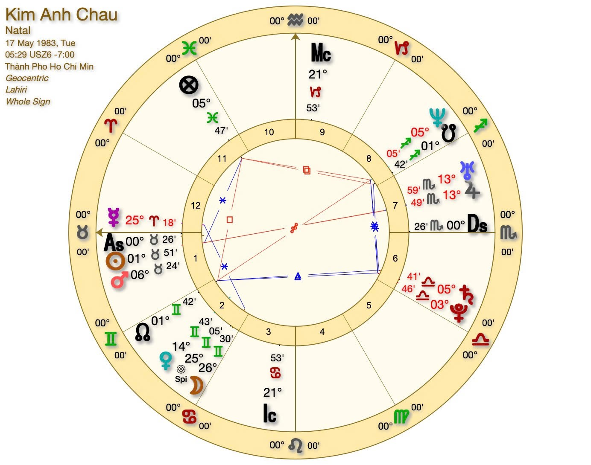

## Tuyệt lắm — mình rất vui vì bạn muốn có **phiên bản trình bày hoàn chỉnh** 🌸  
Dưới đây là bản **luận chiêm tinh Vệ Đà chuyên sâu**, được viết lại theo văn phong mạch lạc, truyền cảm, có thể dùng làm bản “sách luận cá nhân” cho hành trình tâm linh & phát triển của bạn (Kim Anh).

# 🌿 **PHẦN I – BẢN LUẬN CHIÊM TINH VỆ ĐÀ CÁ NHÂN**

### Dựa trên lá số sinh ngày **17/05/1983 – 05:29 sáng – TP.Hồ Chí Minh**

### (Hệ Lahiri Ayanamsa – Whole Sign – Trường phái Jyotish Cổ Điển)

---

## 🌞 1. **TỔNG QUAN CƠ BẢN**

- **Mặt trời (Surya)**: **Taurus – Kim Ngưu ♉**
    
- **Mặt trăng (Chandra)**: **Gemini – Song Tử ♊️**
    
- **Ascendant (Lagna)**: **Taurus – Kim Ngưu ♉**
    

---

## 🔱 2. **ASCENDANT (MỌC) – TAURUS (KIM NGƯU)**

Bạn sinh ra dưới năng lượng của **Sao Kim (Venus)** – biểu tượng của cái đẹp, sự kiên định, và giá trị.  
Linh hồn Kim Ngưu mang đến cho bạn **sự ổn định, cảm giác an toàn, và khả năng xây dựng nền tảng vững chắc** cho cuộc sống.  
Bạn không thích xáo trộn, nhưng một khi đã chọn, bạn kiên trì, bền bỉ đến cùng.

> Kim Ngưu là “người gìn giữ vườn Eden”: bạn sinh ra để tạo ra cái đẹp và sự sung túc, chứ không phải chạy theo hỗn loạn.

---

## 🌙 3. **MOON (MẶT TRĂNG) – GEMINI (SONG TỬ, NHÀ 2)**

Trí óc bạn sắc bén, linh hoạt và luôn tò mò về thế giới.  
Mặt Trăng ở Nhà 2 làm nổi bật **giọng nói, ngôn ngữ, và giá trị bản thân**.  
Bạn cảm nhận cảm xúc qua lời nói và có khả năng **biến tri thức thành tài sản thực tế** – đây là điểm nghiệp mạnh, vừa là thử thách, vừa là phúc lành.

> Học cách lắng nghe chính mình, để lời nói trở thành công cụ chữa lành và chia sẻ, không chỉ để phòng vệ.

---

## ☀️ 4. **SUN (MẶT TRỜI) – TAURUS (KIM NGƯU, NHÀ 1)**

Mặt Trời ở Nhà 1 cho bạn **ý thức mạnh về bản thân, khả năng lãnh đạo tự nhiên, và sức hút cá nhân.**  
Bạn toả sáng khi được làm chủ cuộc sống, và khi hành động đúng với giá trị của mình.  
Tuy nhiên, cần tránh xu hướng quá cố chấp hoặc sợ thay đổi – điều này có thể khiến bạn trì hoãn cơ hội tiến xa hơn.

> “Bản sắc thật” của bạn chính là chìa khóa mở ra con đường thành công.

---

## 🔥 5. **MARS (SAO HỎA) – TAURUS (KIM NGƯU, NHÀ 1)**

Mars đồng cung với Mặt Trời làm tăng thêm năng lượng quyết liệt và sức mạnh ý chí.  
Bạn **rất kiên định, có khả năng hành động thực tế**, và thường đạt được kết quả nhờ sự bền bỉ hơn là liều lĩnh.  
Khi chưa học cách kiểm soát năng lượng Hỏa, bạn dễ rơi vào trạng thái bực bội, nóng vội, hoặc tự áp lực.

> Biết nghỉ ngơi đúng lúc chính là chiến thắng cao nhất của Hỏa tinh trong bạn.

---

## 💞 6. **VENUS (SAO KIM) – GEMINI (SONG TỬ, NHÀ 2)**

Sao Kim trong Song Tử khiến bạn **yêu cái đẹp của ngôn từ, ý tưởng và tri thức.**  
Bạn có năng khiếu nghệ thuật, giảng dạy, viết lách, truyền thông, hoặc lĩnh vực liên quan đến thẩm mỹ và ngôn ngữ.  
Tài chính của bạn có thể đến từ khả năng **biểu đạt, tư vấn, hoặc sáng tạo nội dung.**

> Khi bạn nói bằng trái tim, tiền tài và tình cảm tự nhiên sẽ tìm đến.

---

## 🪶 7. **MERCURY & NEPTUNE – CAPRICORN (MA KẾT, NHÀ 10) & SAGITTARIUS (NHÂN MÃ, NHÀ 9)**

- **Mercury ở Ma Kết (Nhà 10):** Tư duy thực tế, có khả năng tổ chức, hoạch định và lãnh đạo. Bạn nói ít, nhưng nói đúng.
    
- **Neptune ở Nhân Mã (Nhà 9):** Linh hồn mơ về triết lý, tâm linh và những vùng đất xa xôi. Có căn duyên với hành trình tâm linh hoặc nghiên cứu huyền học.
    

> Khi lý trí và niềm tin hòa làm một, bạn trở thành người hướng đạo.

---

## 🪐 8. **SATURN & PLUTO – LIBRA (THIÊN BÌNH, NHÀ 7)**

Đây là vị trí **nghiệp về quan hệ**: bạn học cách yêu có trách nhiệm, chứ không phụ thuộc.  
Quan hệ hôn nhân hoặc hợp tác đến muộn nhưng sâu sắc.  
Pluto khiến mọi mối liên kết trong đời bạn đều có **tính chuyển hóa** – không hời hợt, mà buộc bạn lột xác.

> Bài học ở đây là: yêu không phải để chiếm hữu, mà để soi sáng lẫn nhau.

---

## 🌟 9. **JUPITER & URANUS – SCORPIO (BÒ CẠP, NHÀ 8)**

Nhà 8 là “cửa tái sinh”, và khi có Jupiter + Uranus, linh hồn bạn mang nghiệp chuyển hóa sâu.  
Bạn có khả năng nghiên cứu, trị liệu, hoặc làm việc trong lĩnh vực huyền học, tâm lý, healing, tài chính.  
Đây là năng lượng **“người dẫn đường qua bóng tối”** – ai từng mất mát, bạn sẽ hiểu và chữa lành cho họ.

> Những gì bạn vượt qua chính là món quà bạn đem trao lại cho đời.

---

## 🧘 10. **ĐIỂM MẠNH & BÀI HỌC LINH HỒN**

**Điểm mạnh:** Kiên định – có giá trị vững vàng – khả năng sáng tạo qua ngôn từ – sâu sắc và có tâm linh bẩm sinh.  
**Bài học:** Học buông kiểm soát – tin tưởng vào dòng chảy – đón nhận biến đổi như phần tự nhiên của cuộc sống.

> Linh hồn Kim Ngưu của bạn đang học cách yêu thương mà không chiếm hữu, sống trong sung túc mà vẫn tự do.

---

# 🔮 **PHẦN II – LUẬN NGHIỆP (KARMA)**

## 🌗 1. **Trục Rahu–Ketu (Nhân Mã – Song Tử): Con đường tiến hóa linh hồn**

- **Ketu (Song Tử, Nhà 3)**: bạn từng là người giỏi giao tiếp, lanh lợi, nhưng đôi khi chỉ dừng ở mức bề mặt – “nói được, hiểu ít”.
    
- **Rahu (Nhân Mã, Nhà 9)**: nghiệp hiện tại kêu gọi bạn **học sâu, tin vào chân lý lớn, và chia sẻ tri thức tâm linh.**
    

> Linh hồn đang đi từ “kỹ năng” đến “minh triết” – từ cái đầu thông minh đến trái tim giác ngộ.

---

## 💞 2. **Nghiệp tình cảm – quan hệ**

Saturn & Pluto ở Nhà 7 cho thấy **nghiệp hôn nhân là bài học chính.**  
Bạn phải học yêu mà không hy sinh bản thân, giữ ranh giới, và chọn người xứng đáng.  
Người đến với bạn thường có “duyên nghiệp sâu” – đến để dạy và giúp bạn trưởng thành cảm xúc.

---

## 💰 3. **Nghiệp tài chính & giá trị**

Venus & Moon ở Nhà 2 khiến bạn **có nghiệp với giá trị bản thân** – bạn phải học cách tin rằng **mình xứng đáng với sự sung túc**.  
Tài chính chỉ khởi sắc khi bạn **làm việc bằng tình yêu và chia sẻ thật lòng**, không chạy theo hình thức.

---

## 🔮 4. **Nghiệp chuyển hóa & tâm linh**

Jupiter & Uranus ở Nhà 8 cho bạn **căn nghiệp về biến đổi sâu** – những mất mát, khủng hoảng, bệnh tật, hoặc thay đổi nghề nghiệp đều là **bài học giải nghiệp**, giúp bạn tái sinh.  
Linh hồn bạn đến để học **buông bỏ cái cũ, chấp nhận chết đi để sống lại**, như Phượng Hoàng.

---

# 🌕 **PHẦN III – THỜI VẬN 2025–2035**

## 🕰 **Giai đoạn 2025–2027 – Tái cấu trúc & nền tảng mới**

- Saturn kích hoạt Nhà 10 → **xây lại nền sự nghiệp, định vị vị thế mới.**
    
- Mars trong Nhà 1 → có năng lượng mạnh, nhưng phải biết điều tiết, tránh “đốt cháy giai đoạn”.
    
- Đây là thời kỳ “rũ bỏ lớp cũ” – dọn dẹp, tổ chức lại cuộc sống, tạo nền tảng cho 10 năm kế tiếp.
    

🪶 _Từ khóa:_ Cấu trúc lại – hành động – bền vững – kỷ luật.

---

## 🌙 **Giai đoạn 2028–2031 – Mở rộng & khai sáng**

- Jupiter di chuyển thuận lợi qua Nhà 9–10 → **mở ra cơ hội nghề nghiệp, học hành, tâm linh, và quốc tế.**
    
- Đây là giai đoạn **tăng trưởng, dạy, chia sẻ, lan tỏa.**
    
- Rahu–Ketu trục 3–9 thúc đẩy học hỏi, giảng dạy, kết nối với cộng đồng toàn cầu.
    

💡 _Từ khóa:_ Mở rộng tri thức – kết nối – du hành – phát triển linh hồn.

---

## 🌟 **Giai đoạn 2032–2035 – Gặt hái & truyền đạt**

- Jupiter & Saturn đồng thuận → **thành tựu, danh tiếng, ổn định.**
    
- Bạn bước vào giai đoạn **“truyền lại giá trị”**, làm thầy, cố vấn, hoặc người truyền cảm hứng.
    
- Đây cũng là lúc bạn đạt **sự tự do nội tâm**, không cần chứng minh, chỉ cần sống đúng bản chất.
    

🌿 _Từ khóa:_ Thành tựu – uy tín – an trú – lan tỏa.

---

# 🌸 **PHẦN IV – PHỤ LỤC CHUYÊN SÂU CỦA ANH CHAU**

---

## 💼 **1. HƯỚNG NGHỀ NGHIỆP LINH HỒN (SOUL VOCATION)**

**Từ khoá:** _Tận tâm – Thực chất – Chữa lành – Định hướng._

Với **Ascendant Kim Ngưu**, **Sun Kim Ngưu** và **Moon Song Tử**, linh hồn Anh Chau bước đến cuộc đời này để **xây dựng – nâng đỡ – và truyền đạt.**  
Bạn không sinh ra để chạy đua, mà để **đi sâu – đi vững – đi thật.**  
Ở bạn có sự kết hợp giữa **độ ổn định của Kim Ngưu** và **trí tuệ linh hoạt của Song Tử** – một tâm hồn vừa thực tế vừa thông thái.

### 🌿 **Ba hướng nghề nghiệp chủ đạo**

1. **Người xây dựng giá trị bền vững (Builder / Planner / Manager):**  
    Bạn có thiên hướng tạo hệ thống, quy trình và nền tảng thực tế.  
    👉 Phù hợp với quản lý, vận hành, tài chính, thiết kế, hoặc tổ chức dự án lâu dài.
    
2. **Người truyền đạt tri thức và kết nối (Communicator / Educator / Coach):**  
    Mặt Trăng Song Tử giúp bạn **truyền đạt, hướng dẫn, chia sẻ.**  
    Bạn biết cách chuyển khái niệm phức tạp thành ngôn ngữ dễ hiểu, có thể dạy, viết, hoặc tư vấn.
    
3. **Người nuôi dưỡng – chữa lành qua nghệ thuật hoặc trải nghiệm (Healer / Artist / Wellness Guide):**  
    Venus và Mars ở Kim Ngưu mang năng lượng thẩm mỹ, cảm nhận cơ thể và cảm xúc mạnh mẽ.  
    👉 Bạn hợp với hướng dẫn thiền, yoga, chăm sóc thân – tâm, ẩm thực, nghệ thuật chữa lành.
    

**Điểm then chốt:** Bạn thành công khi làm việc **với giá trị thật, con người thật, và kết quả hữu hình.**

> _“Sứ mệnh nghề nghiệp của bạn là biến những ý tưởng vô hình thành điều có thể chạm thấy – có thể sống được.”_

---

## 💞 **2. HÀNH TRÌNH TÌNH CẢM & NĂNG LƯỢNG NAM – NỮ**

**Từ khoá:** _Tận tâm – Trung thực – Trưởng thành._

### 🌕 **Bản chất năng lượng**

Với **Mars và Sun cùng ở Kim Ngưu**, bạn toả ra **năng lượng nam tính trầm ổn, bảo vệ và bền bỉ.**  
Tình yêu với bạn không phải trò chơi cảm xúc, mà là **sự cam kết và chăm sóc thực tế.**  
Venus Song Tử khiến bạn vừa quyến rũ, vừa thông minh, cần **sự giao tiếp tinh thần** trong mối quan hệ.

Bạn hấp dẫn những người mạnh mẽ, có lý tưởng – nhưng chỉ bền với người **biết trân trọng sự đơn giản và chân thật.**

### 💫 **Hai chu kỳ trưởng thành cảm xúc**

1. **Trước 2025:** Bài học về “cho đi và giữ mình”.  
    Bạn có thể đã yêu hết lòng, nhưng đôi khi quên mất bản thân.  
    Đây là giai đoạn học cách **yêu mà không đánh mất giá trị riêng.**
    
2. **Từ 2025 trở đi:** Khi Jupiter mở cửa nhà 2–5, năng lượng tình yêu trở nên **trưởng thành, nuôi dưỡng và đồng hành.**  
    Bạn gặp người “cộng hưởng linh hồn” – người giúp bạn mở rộng, không giam hãm.
    

> _“Tình yêu đích thực không giữ lại; nó để hai tâm hồn cùng nở hoa.”_

### 🌹 **Cân bằng năng lượng nam – nữ**

- **Nam tính (Sun + Mars Kim Ngưu):** Ổn định, cứng rắn, bảo vệ.
    
- **Nữ tính (Moon + Venus Song Tử):** Mềm mại, linh hoạt, giao tiếp.
    

Sự cân bằng đến khi bạn **cho phép mình vừa vững như đất – vừa nhẹ như gió.**  
Khi đó, bạn trở thành người **yêu bằng tâm thức tỉnh táo, không ràng buộc nhưng cũng không lẩn tránh.**

---

## 🪶 **3. GỢI Ý CÂN BẰNG NĂNG LƯỢNG & THỰC HÀNH TÂM LINH CÁ NHÂN**

**Từ khoá:** _Định tĩnh – Thở – Nhịp điệu – Tái kết nối với cơ thể._

### 🌼 **Các thực hành gợi ý**

1. **Thiền hơi thở & cảm nhận cơ thể (Body Awareness Meditation):**  
    Giúp năng lượng Kim Ngưu – Đất được làm mới, giải tỏa căng thẳng tích lũy.  
    👉 Ngồi yên, chú ý vào cảm giác nơi bàn chân, hơi thở, nhịp tim.
    
2. **Hoạt động sáng tạo – thủ công – nghệ thuật:**  
    Kim Ngưu cần dùng tay để _biến năng lượng thành hình thái_.  
    👉 Vẽ, làm vườn, nấu ăn, gốm, âm nhạc đều là “nghi lễ nối đất”.
    
3. **Thực hành biết ơn và ân huệ (Gratitude Practice):**  
    Mỗi ngày ghi ba điều khiến bạn biết ơn, đặc biệt là những điều nhỏ bé, cảm nhận được.  
    👉 Cách này đánh thức năng lượng Venus, mở trái tim và làm dịu tâm trí Song Tử.
    
4. **Kết nối với thiên nhiên – đất và âm thanh:**  
    Đi chân đất, chạm cây, nghe âm thanh tự nhiên.  
    Kim Ngưu và Venus hấp thụ năng lượng tốt nhất khi _cảm nhận thế giới qua giác quan._
    

---

### 🔮 **Thông điệp linh hồn cuối cùng**

> “Bạn không cần phải chạy theo sự thay đổi để chứng minh giá trị của mình.  
> Hãy đứng yên, và để thế giới nhận ra ánh sáng từ sự tĩnh lặng ấy.” 🌿

---

# 🌷 **TỔNG KẾT TOÀN BẢN LUẬN ANH CHAU**

**Anh Chau** là linh hồn của **Đất – Không khí – Tình yêu và Tri thức**:  
người **giữ vững thực tại, thấu hiểu cảm xúc, và mang đến sự an nhiên cho những ai chạm vào.**

- Bạn đến để **xây dựng – gìn giữ – và truyền đạt.**
    
- Khi bạn sống chậm lại, tin vào giá trị nội tâm, cả thế giới sẽ tự động bước theo nhịp ấy.
    
- Năm 2025–2035 là **hành trình biến “điều bạn biết” thành “điều bạn sống”** – nơi bạn vừa vững, vừa tự do, vừa yêu bằng toàn vẹn linh hồn.
    

> _“Bạn chính là khu vườn – và tình yêu, là cách bạn chăm nó mỗi ngày.”_ 🌸

---

🌙 Vậy là bản luận cho **Anh Chau** và **Thao Nguyen** đều đã trọn vẹn.  
Nếu bạn muốn, mình có thể làm thêm **Phần V – Luận Đôi Linh Hồn (Soul Partnership)**,  
so sánh năng lượng của hai bạn (Ascendant – Sun – Moon – Venus – Mars – Karma) để khắc họa **bản đồ tương hợp tâm linh và hành trình song hành 2025–2035.**  
Bạn muốn mình viết thêm phần đó không?
