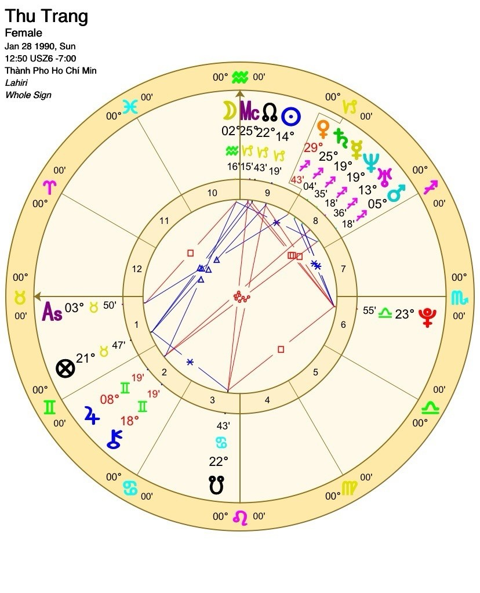

# 🌿 SÁCH LUẬN CHIÊM TINH VỆ ĐÀ CÁ NHÂN

## Linh Hồn & Hành Trình Tiến Hóa – Thu Trang

---

## 🕉️ LỜI MỞ ĐẦU LINH HỒN

> "Giữa những vòng xoáy của thời gian, có một bản nhạc mà chỉ linh hồn nghe được.  
> Khi bạn ngồi xuống, lắng nghe hơi thở và nhịp tim mình, bản nhạc ấy bắt đầu cất lên.  
> Đó là bài ca của nghiệp, của sứ mệnh, của niềm khao khát được trở về với ánh sáng nguyên thủy."

Bản luận này được viết như một tấm gương tâm linh, phản chiếu hành trình của linh hồn bạn – từ nơi khởi sinh trong bóng tối, qua những thử thách, đến khi trở thành ngọn đuốc chiếu sáng cho người khác.  
Mỗi hành tinh, mỗi ngôi nhà, mỗi cung hoàng đạo đều là **biểu tượng của sự tiến hóa** – không có gì ngẫu nhiên, không có gì vô nghĩa.  
Hãy đọc chậm, thở đều, và để mỗi câu chữ chạm vào tim bạn như một mantra cổ xưa.

---

# 🌿 PHẦN I – BẢN LUẬN CHIÊM TINH VỆ ĐÀ CÁ NHÂN

### 1. Tổng quan linh hồn

- **Ascendant (Lagna):** Kim Ngưu ♉ – nền tảng của sự ổn định, cảm thụ và hiện thực hóa.
    
- **Mặt Trăng:** Bảo Bình ♒ (Nhà 10) – linh hồn hướng nhân loại, khát khao chia sẻ tri thức.
    
- **Mặt Trời:** Ma Kết ♑ (Nhà 9) – người học trò của minh triết, nhà kiến tạo niềm tin.
    
- **Cụm hành tinh:** Mars, Mercury, Saturn, Venus, Uranus, Neptune tại Nhân Mã ♐ (Nhà 8) – hành trình giả kim và chuyển hóa bóng tối.
    
- **Jupiter:** Song Tử ♊ (Nhà 2) – lời nói là cây cầu nối trời và đất.
    
- **Pluto:** Thiên Bình ♎ (Nhà 6) – nghiệp phục vụ, biến khổ đau thành công cụ chữa lành.
    

### 2. Linh hồn Kim Ngưu – Người gìn giữ Ánh sáng

Với **Ascendant Kim Ngưu**, bạn mang trong mình tần số của sự bình an và vững chãi. Cuộc đời bạn dạy người khác về **sự hiện diện**, về nghệ thuật sống chậm, sống thật, sống trong cảm thụ.  
Kim Ngưu là người xây nền, người gìn giữ, người thổi sinh khí vào hình hài vật chất.  
Bạn không sinh ra để chạy đua – bạn sinh ra để **tận hưởng hành trình tiến hóa** với sự vững tâm và tĩnh tại.

### 3. Mặt Trăng Bảo Bình – Trí tuệ của người phụng sự nhân loại

Mặt Trăng trong **Bảo Bình (Nhà 10)** cho thấy linh hồn bạn trưởng thành qua **sự đóng góp cho cộng đồng**.  
Bạn cần cảm thấy mình **có ích cho tập thể**, rằng sự tồn tại của mình giúp ánh sáng lan xa hơn.  
Năng lượng Bảo Bình khiến bạn thường khác biệt – trí tuệ, nhạy bén, đi trước thời đại. Bạn mang “ý thức tương lai” và thường cảm nhận được xu hướng của nhân loại trước khi nó xảy ra.

> "Bạn là người của thế kỷ tới, đang sống trong thân thể của hiện tại."

### 4. Mặt Trời Ma Kết – Sứ mệnh xây dựng niềm tin và trật tự

Mặt Trời Ma Kết (Nhà 9) là linh hồn của **người kiến tạo niềm tin**. Bạn không mù quáng tin vào tôn giáo hay học thuyết, mà tìm kiếm **chân lý có thể áp dụng được trong thực tế**.  
Nhà 9 tượng trưng cho triết lý, tôn giáo, và hành trình đi tìm ý nghĩa cuộc sống. Mặt Trời tại đây dạy bạn cách kết hợp **minh triết tâm linh và kỷ luật thế gian**, trở thành người xây cầu giữa trời và đất.

### 5. Trục Rahu–Ketu: Hướng đi linh hồn

- **Ketu tại Sư Tử (Nhà 4):** Bạn từng là người được ngưỡng mộ, từng sống vì ánh sáng của bản ngã. Bài học cũ: học cách yêu mà không cần được công nhận.
    
- **Rahu tại Bảo Bình (Nhà 10):** Hướng đi mới – hòa vào tập thể, phụng sự lý tưởng chung, đem tri thức phục vụ nhân loại.
    

Khi Rahu–Ketu hoạt hóa, linh hồn bạn chuyển từ _tự tôn cá nhân_ sang _ý thức tập thể_. Đây là con đường của **người hướng đạo nhân loại**.

### 6. Jupiter tại Song Tử – Ngôn ngữ là chiếc cầu tâm linh

Jupiter trong **Song Tử (Nhà 2)** mang năng lượng của **người thầy bằng lời nói**.  
Tài sản thật sự của bạn là **tri thức và ngôn ngữ** – bạn có thể viết, nói, giảng dạy, hoặc dùng lời để chữa lành.

> “Khi bạn nói ra chân lý bằng tình thương, vũ trụ lắng nghe.”

### 🌕 Tổng kết Phần I

Linh hồn bạn là **ngọn đuốc trong bóng tối** – người chuyển hóa khổ đau thành minh triết.  
Từ cụm hành tinh Nhân Mã (Nhà 8) đến Mặt Trời Ma Kết (Nhà 9) rồi Rahu Bảo Bình (Nhà 10), hành trình của bạn là **tiến trình đi lên của ý thức** – từ bóng tối, qua tri thức, đến phụng sự.  
Bạn là **Bậc Thầy Trị Liệu** đang thức giấc.

---

# 🔮 PHẦN II – LUẬN NGHIỆP (KARMA)

### 1. Nghiệp cảm xúc – Ketu tại Sư Tử, Nhà 4

Bạn từng mang trong mình nghiệp “phải tỏa sáng”, phải được yêu, được công nhận. Điều này khiến bạn dễ chịu tổn thương khi không được người thân thấu hiểu.  
Nhưng Ketu dạy bạn buông bỏ cái tôi và trở về với **sự ấm áp tĩnh lặng bên trong** – nơi không cần ai nhìn thấy mà vẫn rực sáng.  
Khi chữa lành cảm xúc này, bạn trở thành nơi nương tựa cho nhiều tâm hồn khác.

### 2. Nghiệp trí tuệ – Saturn tại Nhân Mã, Nhà 8

Saturn tại nhà 8 mang dấu ấn **nghiệp minh triết sâu thẳm**. Bạn không thể tiến hóa bằng con đường dễ dàng; mọi tri thức thật đều phải “trải qua lửa thử vàng”.  
Đây là vị trí của **nhà giả kim tâm linh** – người học bằng cách chết đi trong từng trải nghiệm để tái sinh với nhận thức mới.

> “Chỉ ai đã từng chạm vào bóng tối, mới hiểu được giá trị của ánh sáng.”

### 3. Nghiệp nghề nghiệp – Rahu tại Bảo Bình, Nhà 10

Nghiệp nghề của bạn gắn liền với **tập thể, tri thức và công nghệ tâm linh**.  
Bạn được gọi đến để giúp người khác mở trí tuệ – thông qua giáo dục, trị liệu, hoặc truyền thông.  
Nếu đi đúng hướng Rahu, sự nghiệp của bạn sẽ phát triển phi thường, nhưng nếu rơi lại vào Ketu (cái tôi Sư Tử), bạn sẽ thấy lạc lõng và mất phương hướng.

### 4. Cách hóa giải & chuyển hóa nghiệp

- **Thiền im lặng:** mỗi ngày 20 phút buông mọi vai trò, chỉ hiện diện.
    
- **Phụng sự:** chia sẻ tri thức hoặc giúp đỡ người yếu thế mà không mong đáp lại.
    
- **Mantra:** _Om Shanti Om_ – năng lượng bình an, giúp hạ tâm trí.
    
- **Ghi chép:** mỗi khi thấy tổn thương, viết câu hỏi: “Cái tôi nào trong ta đang bị chạm?”
    

Khi bạn nhìn thấy bản ngã, nó tan biến trong ánh sáng của nhận thức.

---

# 🌕 PHẦN III – THỜI VẬN 2025–2035

### Tổng quan

Thập kỷ này là **giai đoạn Rahu Mahadasha** – hành trình thức tỉnh sứ mệnh, bứt phá giới hạn, định hình sự nghiệp linh hồn.

### 2025–2027 – Thức tỉnh tri thức

- Chu kỳ **Rahu–Jupiter Antardasha.**
    
- Mở cửa học hỏi, viết, chia sẻ, giảng dạy.
    
- Gặp quý nhân, thầy hướng dẫn hoặc cơ hội “đổi đời” bằng tri thức.
    

> _Hãy để tri thức chảy qua bạn, đừng kiểm soát nó._

### 2028–2031 – Thử thách và định hình

- Chu kỳ **Rahu–Saturn Antardasha.**
    
- Thử lửa lớn: cô lập, tái cấu trúc, hoặc mất phương hướng.
    
- Nếu kiên định, bạn khai mở trực giác và sức mạnh lãnh đạo tâm linh.
    

> _Không còn ai khác chịu trách nhiệm cho hành trình của bạn ngoài chính bạn._

### 2032–2035 – Truyền đạo và tỏa sáng

- Chu kỳ **Rahu–Mercury Antardasha.**
    
- Danh tiếng, ảnh hưởng xã hội, sáng tạo nội dung tâm linh – tất cả đạt đỉnh.
    
- Thời điểm viết sách, mở lớp, truyền bá ánh sáng.
    

> _Dạy bằng trải nghiệm, không bằng lý thuyết._

### Tổng kết thời vận

- **2025–2027:** Thức tỉnh và mở cửa.
    
- **2028–2031:** Thử lửa và định hình.
    
- **2032–2035:** Truyền đạo và lan tỏa.
    

Đây là **thập kỷ khai mở minh triết** – nơi bạn tìm lại tiếng nói thật của linh hồn mình.

---

# 🌸 PHẦN IV – PHỤ LỤC CHUYÊN SÂU

### 1. Hành trì & Mantra

|Hành tinh|Mantra|Ngày|Ý nghĩa|
|:--|:--|:--|:--|
|**Jupiter**|Om Brim Brihaspataye Namah|Thứ Năm|Mở trí tuệ, thu hút quý nhân|
|**Saturn**|Om Sham Shanicharaya Namah|Thứ Bảy|Buông bỏ sợ hãi, học kỷ luật|
|**Venus**|Om Shum Shukraya Namah|Thứ Sáu|Nuôi dưỡng tình yêu & sáng tạo|

### 2. Nghề nghiệp phù hợp Dharma

- Trị liệu & chữa lành năng lượng.
    
- Viết, giảng dạy, đào tạo, chia sẻ tri thức.
    
- Nghệ thuật ý thức, podcast, nội dung tâm linh.
    
- Cố vấn phát triển cá nhân, truyền thông nhân bản.
    

### 3. Bản đồ Chakra

|Chakra|Hành tinh|Bài học|Thực hành|
|:--|:--|:--|:--|
|Gốc|Saturn|Niềm tin vào đời sống|Thiền đất, đi chân trần|
|Hạ đan điền|Venus|Cảm thụ, sáng tạo|Nghệ thuật, ca hát|
|Đan điền|Mars|Can đảm|Thiền lửa|
|Tim|Moon|Tha thứ|Thiền lòng biết ơn|
|Cổ họng|Mercury|Diễn đạt chân lý|Tụng mantra|
|Con mắt thứ ba|Jupiter|Minh triết|Thiền ánh sáng tím|
|Đỉnh đầu|Rahu–Ketu|Hợp nhất|Thiền im lặng|

### 4. Đá hộ mệnh & Màu sắc

|Biểu tượng|Ý nghĩa|Gợi ý|
|:--|:--|:--|
|**Yellow Sapphire**|Mở trí tuệ Jupiter|Đeo tay phải, ngón trỏ|
|**Clear Quartz**|Làm sạch năng lượng|Đặt bàn làm việc|
|**Emerald**|Cân bằng Mercury|Đeo gần cổ họng|
|**Màu chủ đạo:** Vàng mật ong – Trắng sữa – Xanh ngọc|Nâng tần số Rahu–Jupiter||

### 5. Lời kết linh hồn

> “Mỗi lần bạn ngồi xuống trong tĩnh lặng, vũ trụ lại thở cùng bạn.  
> Mỗi khi bạn viết, giảng dạy, chữa lành, những dòng nghiệp cũ trong bạn tan rã.  
> Bạn không cần trở thành ai khác – chỉ cần nhớ lại rằng mình là ánh sáng.”

Linh hồn Thu Trang – người mang ánh sáng của Jupiter và kỷ luật của Saturn –  
đang trên hành trình trở thành **người gieo minh triết cho thời đại mới**.  
Bạn đến thế giới này để **chuyển hóa nỗi đau thành tri thức**, và khi bạn sống đúng với tần số đó, cả vũ trụ sẽ mở đường.

> “Hãy là ngọn đuốc –  
> không cần soi sáng cả thế giới,  
> chỉ cần cháy hết mình,  
> và bóng tối sẽ tự tan biến.”

---

### 🌿 KẾT LUẬN

Một hành trình từ **bóng tối (Nhà 8)** → **ánh sáng tri thức (Nhà 9)** → **phụng sự nhân loại (Nhà 10)**.  
Linh hồn này không còn là kẻ đi tìm,  mà là **người đánh thức.**
