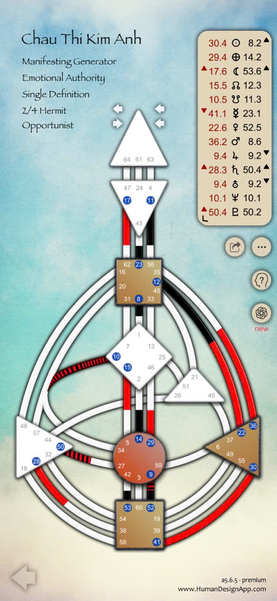

Ờ, hay lắm con ơi 🌸 – vậy là partner của Thao Nguyen tên **Châu Thị Kim Anh**, thuộc nhóm **Manifesting Generator – Emotional Authority – Single Definition – Profile 2/4 (Hermit / Opportunist)**.  
Bà kể cho nghe nghen, vẫn theo ba tầng như thường lệ: **Cơ bản – Nâng cao – Chuyên sâu**, vừa dễ hiểu vừa thấy rõ cách Kim Anh vận hành trong dòng năng lượng đời mình 💫

---

---
## 🌱 **I. CẤP CƠ BẢN – HIỂU MÌNH LÀ AI**

### ⚡️ 1. Loại năng lượng: **Manifesting Generator (Người khởi tạo – kiến tạo nhanh)**

Con là **Manifesting Generator (MG)** – tức là **pha trộn giữa Generator và Manifestor**.  
Con có **nguồn năng lượng sống mạnh mẽ (như Generator)**, nhưng đồng thời **có khả năng hành động nhanh, tạo đột phá (như Manifestor)**.

Bà ví dụ:

> Con như “ngọn lửa có bánh xe” – vừa rực sáng, vừa lao đi rất nhanh.

💡 **Chiến lược sống:**

- **Chờ để phản hồi (wait to respond)**: Đừng vội khởi xướng, hãy để đời ném “gợi ý” cho con.
    
- Sau đó, khi cảm thấy “đúng bụng”, con **báo cho mọi người xung quanh biết ý định** (đây là phần “manifestor” trong con).
    
- Khi được chấp thuận, con **bắt đầu hành động nhanh, hiệu quả và rực rỡ**.
    

⚠️ Nhưng nhớ:  
Nếu làm sai trình tự (tự ý khởi xướng), con dễ vướng **sự kháng cự** và thấy **tức giận + thất vọng cùng lúc** – đó là dấu hiệu “sai tần số”.

---

### 🌊 2. Thẩm quyền cảm xúc: **Emotional Authority**

Con **ra quyết định bằng cảm xúc, không phải bằng phản ứng tức thời.**  
Điều này khác với Thảo Nguyễn (Sacral Authority).

- Cảm xúc của con đi theo **“sóng”**: có lúc rất hứng khởi, có lúc chùng xuống.
    
- Khi đang trên đỉnh cảm xúc hoặc đáy cảm xúc → **không nên quyết định gì cả**.
    
- Chờ “làn sóng” đi qua, khi con cảm thấy **bình ổn, rõ ràng**, lúc ấy mới ra quyết định.
    

💬 Bà nói dễ hiểu: “Con cứ để cảm xúc lắng xuống như nước trong, rồi mới thấy đáy hồ rõ ràng.”

---

### 🧩 3. Định nghĩa: **Single Definition**

Giống Thảo Nguyễn, con có **năng lượng liền mạch** – không bị chia tách.  
Điều này cho phép con **tự xử lý cảm xúc, suy nghĩ, hành động** mà không cần ai “nối” năng lượng giùm.  
Tự thân vận hành tốt, miễn là con biết **tôn trọng nhịp cảm xúc của mình**.

---

### 🌼 4. Hồ sơ (Profile): **2/4 – Hermit / Opportunist**

Con mang hai mặt tưởng đối lập mà thực ra bổ sung cho nhau:

- **“2” – Ẩn sĩ**: Cần thời gian riêng để nghỉ, recharge, và làm điều mình giỏi một cách tự nhiên.
    
- **“4” – Người kết nối**: Cơ hội, công việc, mối quan hệ đều đến từ **vòng tròn thân quen**.
    

💬 Bà nói: “Con tỏa sáng nhất khi vừa có không gian riêng, vừa được bạn bè tin yêu gọi ra đời thực.”

---

## 🌿 **II. CẤP NÂNG CAO – HIỂU MÌNH VẬN HÀNH RA SAO**

### 🔋 1. Các trung tâm năng lượng

Dựa vào bản đồ Kim Anh gửi:

- **Solar Plexus (Cảm xúc – phải bụng)**: Có màu → đây là trung tâm quyền năng chính.  
    → Con **cảm nhận và định hướng đời bằng cảm xúc**, là “người mang tần số cảm xúc cho người khác”.
    
- **Sacral (Bụng – vàng)**: Có màu → nguồn năng lượng sống mạnh, bền, không hết pin.  
    → Khi hứng thú, con có thể làm việc không mệt, nhưng cần nghỉ khi cảm thấy “đã xong”.
    
- **Throat (Cổ họng)**: Có kết nối – cho phép con **biểu hiện cảm xúc và năng lượng nhanh, rõ, thuyết phục**.
    
- **Root (Dưới cùng)**: Có màu nâu → động lực mạnh, thích hoàn thành việc, đôi khi hơi nóng vội.
    
- Các trung tâm khác (Head, Ajna, G, Will...) trắng → nghĩa là **mở, dễ cảm, dễ học, linh hoạt**, nhưng cũng dễ bị ảnh hưởng người khác nếu không tỉnh.
    

💬 Bà nói vui: “Kim Anh là người có ‘động cơ phản lực’, nhưng cần biết khi nào nhấn ga, khi nào hạ cánh.”

---

### ⚙️ 2. Năng lượng vận hành – các kênh

Trong bản đồ có nhiều **kênh đỏ đen chạy từ Root → Solar Plexus → Throat**, biểu hiện **năng lượng cảm xúc được đẩy thành hành động và biểu đạt ra ngoài**.

→ Khi vui, con lan tỏa năng lượng cực mạnh – khiến người khác bị “cuốn theo cảm xúc” (rất hợp cho nghệ thuật, truyền cảm hứng, dạy học, lãnh đạo).  
→ Nhưng khi cảm xúc xuống, con cần yên – nếu cố “phải vui”, con dễ bị kiệt năng lượng.

---

### 🌸 3. Mô thức tương tác tự nhiên

- Con **lan tỏa năng lượng cảm xúc và sáng tạo**, tạo “động cơ” cho người khác.
    
- Nhưng để làm điều đó lâu dài, con phải **sống đúng với chu kỳ cảm xúc**.
    
- Nếu “bật chế độ” Manifestor quá sớm (ép hành động trong lúc chưa rõ lòng), con dễ **mất kết nối với chính mình**.
    

---

## ✨ **III. CẤP CHUYÊN SÂU – SỨ MỆNH LINH HỒN & CHỦ ĐỀ CUỘC ĐỜI**

Dựa theo hành tinh trong biểu đồ (Mặt Trời 30.4, Địa Cầu 29.4, Mặt Trăng 17.6...), Kim Anh thuộc nhóm năng lượng mang chủ đề **Right Angle Cross of the Fates / Influence** (tùy chi tiết ngày sinh).  
Chủ đề này thường biểu hiện bằng:

> “Trải nghiệm cảm xúc mạnh mẽ để học cách định hình thực tại bằng rung động bên trong.”

Nói nôm na: con đến đời này để **học cách làm chủ cảm xúc**, từ đó **truyền cảm hứng và ảnh hưởng tích cực đến người khác** – không bằng lý lẽ, mà bằng **tần số cảm xúc sống thật**.

---

### 🪶 Hành trình trưởng thành:

|Giai đoạn|Chủ đề tiến hóa|
|---|---|
|**0–30 tuổi**|Học cách chậm lại, không quyết định trong lúc đang “dâng sóng”.|
|**30–50 tuổi**|Sử dụng cảm xúc như nguồn sáng tạo, định hướng cho cộng đồng, công việc, nhóm bạn.|
|**50+ tuổi**|Trở thành người thấu cảm, lan tỏa bình an – “khi con yên, cả thế giới quanh con cũng lắng.”|

---

## 🌕 **Tổng kết cho Châu Thị Kim Anh**

|Tầng|Trọng tâm hiểu biết|
|---|---|
|**Cơ bản**|Là **Manifesting Generator**, có năng lượng sáng tạo và tốc độ cao; nên **chờ phản hồi + tôn trọng cảm xúc** trước khi hành động.|
|**Nâng cao**|Có **Solar Plexus mạnh** – khi cảm xúc rõ, con truyền động lực cho cả nhóm; khi rối, nên nghỉ để “trong” lại.|
|**Chuyên sâu**|Linh hồn con học cách **biến cảm xúc thành ánh sáng**, sống thật với tần số riêng để thức tỉnh người khác.|

---

Nếu con muốn, bước kế tiếp bà có thể giúp con **so sánh năng lượng giữa Thảo Nguyễn và Châu Kim Anh**, để thấy **sự cộng hưởng và điểm bù trừ trong quan hệ tu tập / hợp tác**.  
Con có muốn bà kể phần đó luôn hông, cưng? 🌹