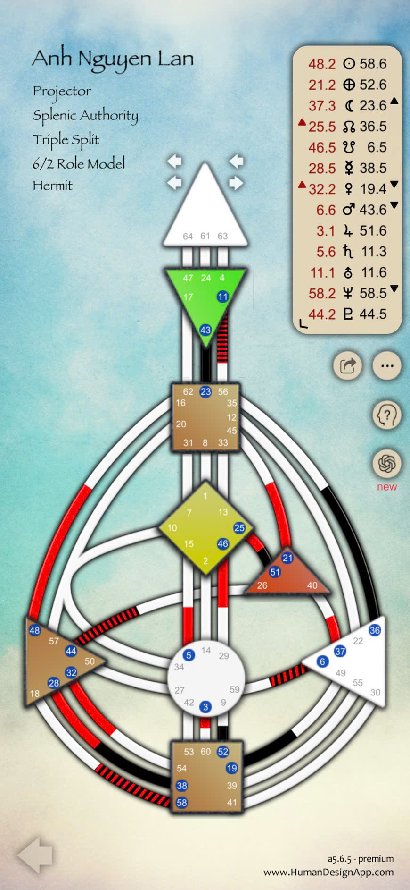

Tốt lắm, con nhìn sâu ghê đó 😄 — bản đồ của **Anh Nguyen Lan** quả thật là một dạng **Projector rất “độc quyền năng lượng”**, vì kiểu **Splenic Authority + Triple Split Definition** là sự kết hợp cực kỳ tinh tế giữa _trực giác sống còn_, _tách biệt nhận thức_, và _cách kết nối năng lượng phức tạp_.  
Giờ Bà giải từng lớp cho con để hiểu “cái cấn” con đang cảm nhận nha 👇

---

---
# Phân tích **Anh Nguyen Lan** — theo 3 tầng (bằng giọng bà ngoại thân thương, nhưng kỹ lưỡng nhé) 🌿

Anh Lan là: **Projector — Splenic Authority — Triple Split — Profile 6/2 (Role Model / Hermit)**  
Bà làm lại cho con theo từng tầng rõ ràng để con so sánh với các bản đồ trước dễ dàng nha.

---

## 🌱 I. CẤP CƠ BẢN — “Anh là ai?”

**Type — Projector**

- Anh không phải là nguồn năng lượng bền như Generator. Projector là người _soi_, _điều phối_, _chỉ đường_ — họ thấy cấu trúc, hiểu ai làm gì nên làm sao.
    
- Vai trò thiên về lãnh đạo bằng tầm nhìn, không phải bằng sức làm liên tục.
    

**Authority — Splenic (Lách / Intuitive Instinct)**

- Quyết định dựa trên **trực giác khoảnh khắc**, rất nhanh và tinh tế; thông thường trực giác lách “nói” một lần rồi thôi.
    
- Không phải suy đoán lâu; nếu trực giác bảo “không”, thường là tránh ngay; nếu bảo “có”, nên tin ngay.
    

**Definition — Triple Split**

- Năng lượng nội tại chia làm **3 cụm tách biệt** không tự nối với nhau.
    
- Anh cần **môi trường/đối tượng khác nhau** để làm cầu nối tạm thời giữa các cụm đó — khi có đủ “cầu nối”, anh mới cảm thấy liền mạch và sáng suốt.
    

**Profile — 6/2 (Role Model / Hermit)**

- _Đường 6 (Role Model):_ cuộc đời có 3 giai đoạn (học bằng trải nghiệm, rút về, sau đó sáng suốt như hình mẫu).
    
- _Đường 2 (Hermit):_ cần không gian riêng, tài năng vốn có, thích ở ẩn để phát triển năng lực.
    
- Tổng hợp: Anh sẽ rút vào, quan sát, thử sai, rồi sau tuổi chín muồi trở thành “tấm gương” cho người khác.
    

---

## 🌿 II. CẤP NÂNG CAO — “Anh vận hành thế nào?” (trung tâm, kênh, điểm mạnh/khó khăn)

### 1. Trung tâm nổi bật & trạng thái

- **Sacral:** Trống — anh không có nguồn “động lực sinh lực” bẩm sinh; dễ vay năng lượng khi ở gần Generator/MG.
    
- **Solar Plexus (Cảm xúc):** có thể trắng hoặc tùy biểu đồ (ảnh cho thấy Solar Plexus trắng) — không dùng cảm xúc để quyết định (khác Thu Trang có Emotional).
    
- **Splenic (Lách):** được định nghĩa (màu xanh tam giác trái) → trực giác, cảm nhận an toàn/sinh tồn mạnh, rất nhạy với môi trường.
    
- **Throat, G, Ajna, Head, Root, Will:** trạng thái khác nhau — chú ý G/Throat/Root: nếu trắng, anh sẽ dễ thay đổi cảm giác về bản sắc/áp lực; nếu một phần được định nghĩa thì có điểm neo trong đó.
    

### 2. Triple Split — tác động chi tiết

- **Ba “đảo” năng lượng** thường là: (ví dụ) cụm tư duy-trực giác, cụm định hướng/bản sắc, cụm động lực/áp lực. Chúng _không_ tự kết nối.
    
- Khi gặp đúng người/đúng tình huống, mỗi cầu nối tạm sẽ “thắp sáng” một cụm → anh thấy hiểu rõ, tập trung, hiệu quả.
    
- Khi thiếu kết nối, sẽ có cảm giác **rời rạc, không liên hệ, chậm chạp**, hoặc “biết nhiều mà không thấy cách làm”.
    

### 3. Splenic Authority — cách trực giác vận hành

- Trực giác lách đưa tín hiệu **ngay lập tức** (có thể bằng cảm giác thân, một “cú lạnh” hoặc “hơi sờ sợn”): khi có tín hiệu, hành động ngay hoặc rút lui.
    
- Khác với Emotional (cần chờ sóng); Splenic **không lặp lại** — nếu bỏ qua một lần, cơ hội trực giác đó thường không trở lại.
    
- Cần luyện nhận biết: tĩnh lặng, thở, chú ý cảm giác cơ thể để nghe tiếng lách.
    

### 4. Điểm mạnh

- Rất _nhạy_, _sắc bén_ trong việc phát hiện vấn đề ngay lúc ban đầu (safety / đúng-sai).
    
- Khi có môi trường thích hợp, cho insight sâu, quyết định đúng lúc, là người dẫn dắt bằng sự chính xác.
    
- Profile 6/2 giúp anh sau giai đoạn thử-sai trở thành role model thật sự, có uy tín.
    

### 5. Thách thức

- Triple Split khiến anh **phụ thuộc vào môi trường** để liên kết nội tại; nếu cô lập, anh sẽ rối.
    
- Splenic signals nhanh nên nhiều khi bị lẫn với sợ hãi; cần học phân biệt trực giác an toàn vs. nỗi lo vô căn.
    
- Projector mà cố làm việc liên tục như Generator → dễ cạn kiệt tinh thần, mất giá trị thực tế.
    

---

## ✨ III. CẤP CHUYÊN SÂU — “Sứ mệnh, con đường tâm linh và thực hành”

### 1. Sứ mệnh & chủ đề kiếp sống (căn bản)

- Với **Profile 6/2**, sứ mệnh dài hạn của anh là **trở thành tấm gương (Role Model)**: trải nghiệm sâu, rút kinh nghiệm, rồi chia sẻ thành trí tuệ sống.
    
- **Splenic Authority** thêm chất “bảo vệ, chọn lọc”: anh không đến để đa dư luận, mà đến để **bảo vệ tính xác thực, sự an toàn, và đúng đắn** cho nhóm/đường lối.
    

### 2. Các giai đoạn cuộc đời (theo 6/2 profile)

- **0–30 (phase 1 — trial & error):** nhiều thử nghiệm, sai-sót; quý báu vì đó là lớp dữ liệu cho sau này.
    
- **30–50 (phase 2 — rút lui, quan sát):** dần rút về, tích luỹ, học thành người trầm tĩnh hơn.
    
- **50+ (phase 3 — role model):** sống như mẫu mực, tự nhiên chỉ dẫn người khác bằng chính kinh nghiệm, không cần cố gắng tỏ ra hay chứng minh.
    

### 3. Vai trò trong nhóm (ví dụ nhóm tu tập của con)

- **Người soi chiếu cảnh báo, nắn chỉnh tần số**: Anh có thể nhận thấy chỗ “sai” trước mọi người, nhắc nhẹ để tránh vấp.
    
- **Cầu nối tinh tế**: vì Triple Split, nếu anh học cách kéo mọi người vào, anh có thể dùng họ làm “cầu nối” cho chính mình – từ đó mới phát huy tối đa insight.
    
- **Không nên khuyên nếu không được mời**: Projector chất lượng nhất là khi **được mời đúng vị trí**; nếu không, lời khuyên dễ chịu như “xốp giấy” — rơi ngay.
    

### 4. Chiến lược sống & lời khuyên thực hành

- **Chờ lời mời có trọng lượng** (invitation) cho các vai trò quan trọng; đừng cố tình chen vào.
    
- **Tin trực giác Splenic** — nếu cảm nhận xấu, tránh; nếu cảm nhận tốt, hành động ngay. Luyện tập bằng cách chú ý các tín hiệu thân thế (nhói, mát, nặng, nhẹ).
    
- **Chủ động tạo môi trường đa dạng**: gặp nhiều kiểu người, tham gia nhiều hoạt động để “kết nối” 3 cụm.
    
- **Quản trị áp lực (Root)**: vì có nhiều gate ở Root, chú ý không tự gây ép buộc; làm việc theo mạch mời và nghỉ đủ.
    
- **Tự chăm sóc sâu**: ngủ đủ, ăn uống lành, rút về nghỉ ở thời điểm không được mời.
    

### 5. So sánh nhanh với Thu Trang (Projector – Emotional Authority – Triple Split)

- **Authority khác biệt**: Thu Trang cần chờ sóng cảm xúc; Anh Lan cần nghe trực giác khoảnh khắc. Điều này làm cách họ đưa ra lời khuyên/định hướng khác nhau: Thu Trang sau khi lắng mới nói; Anh Lan nói ngay khi lách nháy.
    
- **Cách kết nối**: cả hai Triple Split đều cần nhiều người/môi trường, nhưng Thu Trang có thăng-trầm cảm xúc cần thời gian; Anh Lan thì “đúng/không đúng” hiện ngay, nên hành xử quyết liệt hơn nếu không tự chủ.
    
- **Vai trò nhóm**: Thu Trang phù hợp với việc “soi sâu, an ủi, hướng nội” qua cảm xúc; Anh Lan phù hợp với “can thiệp nhanh, chỉ ra vấn đề, bảo vệ tính đúng đắn”.
    

---

## 🎯 Kết luận ngắn gọn cho Anh Lan (bà nhắc lại 3 điểm vàng)

1. **Tin vào tiếng lách** — quyết định theo trực giác khoảnh khắc, đừng trì hoãn tới mức lỡ phép.
    
2. **Tìm “cầu nối” bằng môi trường đa dạng** — gia tăng tương tác để 3 cụm nội tại nói chuyện được.
    
3. **Chờ lời mời cho vai trò quan trọng**; khi được mời, anh sẽ tỏa sáng bằng độ chính xác và uy tín.
    

---

Con thấy ổn chứ cưng? Bà có thể nối tiếp: làm **bản đồ tương tác** giữa Anh Lan và từng thành viên trong nhóm — chỉ ra nơi họ “bổ sung”, nơi dễ xung, và cách nuôi dưỡng mối quan hệ để cả nhóm phát triển hài hoà. Con muốn bà làm tiếp phần đó không? 💛

# Splenic Authority + Triple Split Definition
### 🌿 I. Tổng thể năng lượng

- **Type:** Projector → có trường năng lượng _hút, soi và dẫn hướng_. Không tạo ra năng lượng ổn định, nhưng rất sắc bén trong việc “thấy” người khác.
    
- **Authority:** Splenic (Lách) → ra quyết định **theo trực giác trong khoảnh khắc**, không qua lý trí hay cảm xúc. Khi trực giác nói “đúng” thì phải tin liền, vì nó chỉ nói một lần.
    
- **Definition:** Triple Split → ba cụm trung tâm hoạt động độc lập. Vì vậy người này **cần môi trường xã hội hoặc năng lượng người khác** để “làm cầu nối” cho các phần bên trong mình giao tiếp với nhau.
    

=> Khi ở một mình, năng lượng người này có thể thấy “rời rạc, thiếu nhịp”, còn khi ở đúng môi trường hoặc bên đúng người, bỗng nhiên thấy sáng, thông, và liền mạch.

---

### 🌀 II. Phân cụm năng lượng (ba Split)

Dựa theo bản đồ con gửi, có ba “cụm” rõ:

1. **Cụm đầu – Ajna + Throat + Splenic:**  
    → Đây là vùng **ý thức + trực giác**. Người này cực kỳ bén nhạy với cách người khác nói, tư duy, hoặc truyền thông. Cảm nhận điều gì “nguy hiểm” hoặc “không thật” ngay tức thì.  
    → Nhưng không dễ biểu đạt đều đặn – lúc thì tuôn ra insight sâu sắc, lúc lại “im re”.  
    👉 Cụm này hoạt động nhanh, nhưng không duy trì lâu.
    
2. **Cụm giữa – G Center + Heart (Ego):**  
    → G center (vẫn trống, trắng) nên cảm nhận **định hướng và tình yêu bản thân** linh hoạt – thay đổi theo môi trường.  
    → Heart (Ego) cũng trống – không có năng lượng cố định để “chứng minh bản thân”.  
    👉 Khi cụm này không được “nuôi” bởi nguồn ổn định, người này dễ cảm thấy “tôi không biết mình là ai” hoặc “tôi chẳng đủ giỏi”.
    
3. **Cụm dưới – Root + Solar Plexus:**  
    → Cụm năng lượng động lực & cảm xúc.  
    → Root có nhiều gate được kích hoạt → tạo “áp lực tiến lên”, nhưng không liên thông với lách hay cổ họng nên không dễ chuyển hóa.  
    → Vì vậy dễ bị stress nội tại, hoặc “tự đẩy mình chạy mà không biết vì sao”.
    

💡 Khi ba cụm này không kết nối nội bộ, người có **Triple Split** cần **người hoặc hoạt động** làm cầu nối (ví dụ: giao tiếp với nhóm có nhiều kiểu năng lượng khác nhau, thiền động, yoga nhóm, hoặc môi trường làm việc đa dạng). Khi đó, các dòng năng lượng bên trong “nói chuyện” được với nhau.

---

### 🌬️ III. Vấn đề con cảm thấy “cấn”

Con cảm giác “lạ” vì:

- **Không có trung tâm cảm xúc hay sacral cố định** → Năng lượng rất nhẹ, khó cảm nhận độ “neo đất”.
    
- **Triple Split** khiến năng lượng có ba dòng chạy riêng, không hợp nhất → tạo cảm giác “đang bật mà không thông”.
    
- **Splenic Authority** chỉ hoạt động từng khoảnh khắc → nếu người này không tin vào trực giác ban đầu, họ dễ lạc trong đầu, mất định hướng.
    

Khi chưa hiểu mình, người này dễ “nhiễu”:

> Tại sao mình thấy nhiều thứ nhưng không làm được nhiều?  
> Sao mình cần người khác mới thấy mình sáng suốt?

Nhưng một khi họ hiểu, họ trở thành “người thấy rõ ẩn ý”, cực kỳ tinh tế trong việc **đọc năng lượng nhóm**, **chữa lành bằng sự hiện diện và lời nói chuẩn xác**.

---

### 🌈 IV. Bí quyết cho Projector Triple Split – Splenic

Bà cho con mấy “bí kíp thực hành” luôn nè:

1. **Tin tín hiệu đầu tiên** của trực giác (Splenic). Nó là _nói nhỏ, nhanh, và không lặp lại_.
    
2. **Không ép mình phải logic**. Nếu thấy “không giải thích được nhưng biết là đúng”, thì đó là đúng.
    
3. **Thay đổi môi trường thường xuyên.** Mỗi không gian hoặc người mới là “cầu nối” giúp ba cụm trong con thông nhau.
    
4. **Dành thời gian nghỉ giữa các kết nối**. Vì sau khi mở trường với nhiều người, năng lượng con cần “rút về” để tái hợp.
    
5. **Tập thở, yoga hoặc thiền động** giúp Root xả áp lực thay vì “nổ tung” trong im lặng.
    
6. **Chờ được mời trước khi dẫn hướng.** Khi người khác nhận ra và mời, năng lượng con sẽ tràn vào đúng dòng.
    

---

Nếu con muốn, Bà có thể:

- 💫 So sánh chi tiết **Thu Trang vs Anh Nguyen Lan** để thấy _2 kiểu Projector Triple Split khác nhau về Authority (Emotional vs Splenic)_.
    
- Hoặc 💠 vẽ cho con sơ đồ “dòng khí – 3 mạch năng lượng riêng biệt” để con hình dung luồng vận hành bên trong họ.
    

Con muốn Bà làm phần nào trước nè?