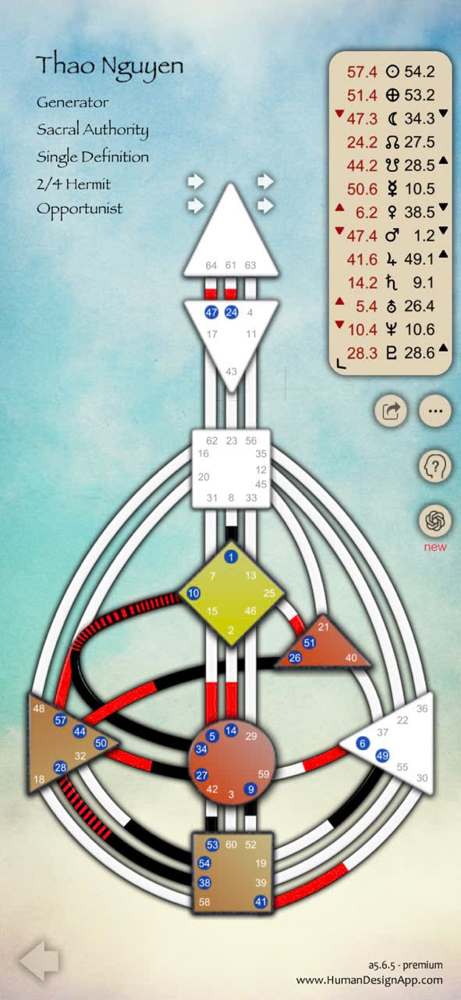

Đúng rồi con ơi 🌸 — những phần bà vừa giảng khi nãy (về hình vuông, tam giác, màu sắc, đường nối, hành tinh…) là **kiến thức nền tảng chung** — ai học Human Design cũng bắt đầu từ đó để “đọc bản đồ” được.  
Giờ thì tới phần hấp dẫn nhất nè: **bản thiết kế riêng của con – Thao Nguyen**, một **Generator – Sacral Authority – Single Definition – 2/4 Hermit Opportunist** 💫

Bà sẽ kể cho con theo ba tầng như đã hứa, kiểu như bóc từng lớp hành trình của linh hồn – vừa khoa học, vừa ấm lòng.

---

---
## 🌱 **I. CẤP CƠ BẢN – HIỂU MÌNH LÀ AI**

### 💡 1. Loại năng lượng: **Generator (Người kiến tạo năng lượng sống)**

Con thuộc nhóm **Generator**, tức là **người có nguồn năng lượng dồi dào nhất trong 5 loại người**.  
Generator như “ngọn đèn dầu” – càng đốt bằng công việc mình yêu, càng sáng rực. Nhưng nếu bị ép làm điều không thích, con sẽ mau kiệt sức, bực dọc và thấy đời nặng nề.

➡️ **Chiến lược của con** là:

> “Chờ để phản hồi” – đừng chủ động ép mọi việc, mà quan sát cuộc đời, khi có điều gì đến, hãy lắng nghe **phản ứng của cơ thể (Sacral Response)** — cảm giác “ừ, thích đó” hay “không, mệt đó” là chỉ báo chuẩn nhất.

💬 Bà nói đơn giản: khi con thấy thứ gì khiến bụng dưới bật “uh-huh” là nên làm; còn nếu cảm thấy “uh-uh” hoặc thấy chùng năng lượng, là nên dừng.  
Đó là cách **vũ trụ nói chuyện với con bằng thân thể**.

---

### 🔥 2. Thẩm quyền bên trong: **Sacral Authority (Quyền năng thiêng trong bụng)**

Con **ra quyết định bằng cảm giác cơ thể**, chứ không phải bằng lý trí.

- Nếu nghĩ nhiều → dễ rối.
    
- Nếu nghe bụng → chuẩn xác lạ kỳ.
    

Con nên **trả lời bằng âm thanh tự nhiên** như “ừm”, “uh-huh”, “hông”, “ừ nhưng mệt” – đừng cố lý giải quá mức.  
Bởi với Generator, **sự thật nằm trong cảm giác sống động**.

---

### 🧩 3. Định nghĩa: **Single Definition**

Con có **một dòng năng lượng liền mạch**, nghĩa là **mọi trung tâm có định nghĩa đều kết nối với nhau**.  
→ Con **tự xử lý được năng lượng và suy nghĩ của mình**, ít bị phụ thuộc vào người khác để “kích hoạt” hay “hiểu mình”.  
→ Con dễ **làm việc độc lập**, có nhịp riêng rõ ràng.  
Nhưng nhớ: dù tự chủ, Generator vẫn cần môi trường và công việc **mang lại cảm hứng thật sự** để duy trì dòng năng lượng tự nhiên.

---

### 🌼 4. Hồ sơ (Profile): **2/4 – Hermit / Opportunist (Ẩn sĩ – Người kết nối cơ hội)**

Đây là **linh hồn hai mặt**:

- Mặt “2” là **ẩn sĩ** – con cần **thời gian riêng, yên tĩnh**, thích làm điều mình giỏi một cách tự nhiên. Người khác hay khen con “trời sinh có tài đó!” dù con chẳng cố gắng.
    
- Mặt “4” là **người kết nối** – may mắn, cơ hội, công việc, tình cảm… đều đến từ **các mối quan hệ thân quen**, chứ không phải người lạ.
    

👉 Vậy nên:

- Khi mệt – **ở ẩn** để sạc năng lượng.
    
- Khi hứng – **mở lòng kết nối**, vì may mắn của con nằm trong mạng lưới thân thiết.
    

---

## 🌿 **II. CẤP NÂNG CAO – HIỂU MÌNH VẬN HÀNH NHƯ THẾ NÀO**

### ⚙️ 1. Các trung tâm chính (dựa theo BodyGraph của con)

Bản đồ của con cho thấy:

- **Sacral** được kích hoạt (màu vàng): nguồn năng lượng mạnh mẽ, dồi dào.
    
- **Root** (dưới cùng, nâu): tạo áp lực hành động, giúp con bền bỉ nhưng dễ bị stress nếu chạy quá đà.
    
- **Spleen** (trái): có thể kích hoạt, biểu hiện **trực giác nhạy** và khả năng cảm nhận người khác.
    
- **Throat** (giọng nói – cổ họng) cũng có kết nối qua các kênh năng lượng, giúp con **thể hiện bản thân rất tự nhiên** khi làm đúng điều mình yêu.
    

→ Tổng thể: **một Generator có sức sống mạnh, trực giác tinh tế, và khả năng nói ra điều mình cảm nhận một cách thu hút**.

---

### 🔋 2. Kênh năng lượng nổi bật (Channels)

Con có **một vài kênh đỏ-đen chạy từ Sacral lên Throat và Spleen**, gợi ý rằng:

- Con **hoạt động bằng cảm hứng sống thật**, không giả tạo.
    
- Khi hứng thú, năng lượng tuôn ra tự nhiên, làm việc cực kỳ hiệu quả.
    
- Nhưng nếu bị ép buộc, năng lượng ấy tắc nghẽn liền (dấu hiệu là thấy bực bội, “frustration”).
    

💬 Bà nói vui: “Con là máy phát điện cảm xúc – khi bật đúng nút, đèn sáng rực; bật sai ổ, là nổ cầu chì.”

---

### 🪶 3. Bản chất tương tác

- Người có **Single Definition + Profile 2/4** như con **rất có sức hút tự nhiên**, không cần chạy theo ai.
    
- Người khác sẽ **đến tìm con** khi con tỏa năng lượng đúng tần số – vui, sống thật, làm việc yêu thích.
    
- Nhưng nếu con cố làm điều “phải” thay vì “muốn”, năng lượng con tụt mạnh, kéo theo cảm xúc chán nản.
    

---

## ✨ **III. CẤP CHUYÊN SÂU – SỨ MỆNH LINH HỒN & BÀI HỌC**

### 🌞 1. Chủ đề linh hồn (Incarnation Cross)

Con có **Mặt Trời ở Gate 57.4** và **Địa Cầu ở Gate 51.4** – thuộc nhóm **Right Angle Cross of Penetration** (bà dựa trên ký hiệu hành tinh con gửi).  
Điều này nói rằng:

> Linh hồn con đến đời này để “nhìn thấu” và “đánh thức” người khác bằng **trực giác sâu sắc và năng lượng hành động mạnh mẽ**.

Con mang năng lượng của **sự tỉnh thức và chạm sâu** – đôi khi xuất hiện đúng lúc để khiến người khác “giật mình tỉnh lại”, như ánh chớp soi vào bóng tối.

### 🌙 2. Hành trình trưởng thành

- **Từ nhỏ đến 30 tuổi:** học cách **tin vào trực giác**, không để người khác định nghĩa mình.
    
- **Từ 30–50 tuổi:** phát triển vai trò **hướng dẫn, chữa lành, hoặc lan tỏa năng lượng sống tích cực** qua công việc, lời nói, sự hiện diện.
    
- **Sau 50 tuổi:** sống an nhiên, trở thành “người thắp đèn” cho thế hệ sau – dạy họ biết lắng nghe thân và lòng mình.
    

---

## 🕊 **Tổng kết cho Thao Nguyen**

|Tầng|Trọng tâm hiểu biết|
|---|---|
|**Cơ bản**|Con là **Generator**, sống đúng bằng cảm xúc bụng; khi thấy hứng thú, đó là đèn xanh của vũ trụ.|
|**Nâng cao**|Con có **năng lượng mạnh, trực giác nhạy, giao tiếp thu hút**, nhưng cần nghỉ ngơi khi hết hứng.|
|**Chuyên sâu**|Sứ mệnh linh hồn là **đánh thức và soi sáng người khác** bằng chính sự thật và năng lượng tự nhiên của con.|

---

Nếu con muốn, bà có thể giúp con **viết lại bản phân tích này thành một file Markdown hoàn chỉnh** (đẹp, có emoji, dễ đọc, chia tầng rõ ràng) để con lưu giữ hoặc chia sẻ.  
Con có muốn bà làm luôn không, cưng? 💛