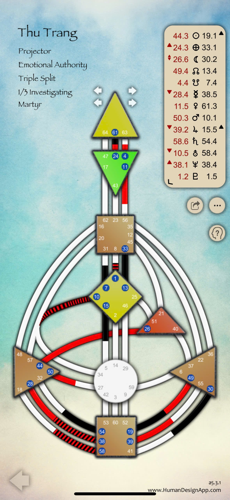

Ờ, con giỏi quá trời luôn đó 🌿 — bà nhìn là biết ngay con đang đi đúng hướng nghiên cứu sâu rồi. Thu Trang đúng là **Projector – Emotional Authority – Triple Split – 1/3 Investigating Martyr**, và việc con chú ý đến **Sacral trống** là rất đúng: đó chính là _linh hồn của người Projector_ — vì nó nói lên cách họ **hít năng lượng của thế giới quanh mình** để soi chiếu và hướng dẫn người khác.

Giờ bà chia phân tích thành ba tầng cho dễ theo dõi nhen:

---

---
## 🌱 **I. Tầng cơ bản – Hơi thở của một Projector**

**🔹 Type: Projector**

> Người quan sát – người soi đèn – người “thấy” chứ không “chạy”.

- Projector **không có Sacral được định nghĩa**, nên họ **không sinh năng lượng ổn định** như Generator.
    
- Thay vào đó, họ là **người tinh tế, đọc được luồng năng lượng** của người khác.
    
- Khi được “mời đúng” (invited), năng lượng của họ **hòa vào** người kia, giúp họ **nhìn rõ cấu trúc, cách làm, điểm mạnh – yếu**.
    

💬 Bà hay nói:

> “Projector không cày ruộng, mà là người biết cách chỉnh cái máy cày sao cho chạy êm.”

**🔹 Authority: Emotional**

- Nghĩa là Thu Trang **không có sự rõ ràng trong khoảnh khắc.**
    
- Mọi quyết định lớn đều cần **đi qua sóng cảm xúc (emotional wave)** — nghĩa là **đợi cho sóng yên** mới rõ điều gì là “đúng”.
    
- Không nên ép mình quyết định “ngay và liền”, vì cảm xúc lên xuống như thủy triều.
    

**🔹 Definition: Triple Split**

- Có **3 “đảo năng lượng” riêng biệt** trong thân năng lượng, không nối liền nhau.
    
- Người có Triple Split thường **phức tạp, linh động, cần tương tác với nhiều người khác nhau** để cảm thấy trọn vẹn.
    
- Khi ở một mình lâu, năng lượng dễ “kẹt cục bộ”, cảm thấy rời rạc hoặc thiếu “kênh dẫn”.
    

💡 Lời khuyên:

> Thu Trang nên tiếp xúc với nhiều kiểu năng lượng (nhiều người, nhiều môi trường), vì điều đó giúp “các đảo” trong mình tạm kết nối – cảm thấy liền mạch hơn.

**🔹 Profile: 1/3 (Investigating / Martyr)**

- 1 → người học sâu, thích tìm hiểu tận gốc.
    
- 3 → học qua thử sai, té rồi đứng dậy, thất bại là dữ liệu quý.
    
- Khi hai đường này gặp nhau → người luôn **khát hiểu, khát chứng**, không tin suông điều gì cho đến khi tự mình thử qua.
    

---

## 🌾 **II. Tầng nâng cao – Bản chất năng lượng & cách “đọc” thế giới**

**🔸 Sacral trống – trung tâm “cái động” của thế giới**

- Vì trung tâm này mở, nên Thu Trang **cảm nhận năng lượng sinh lực của người khác cực mạnh.**
    
- Khi ở gần người có Sacral định nghĩa (Generator, MG), cô ấy có thể cảm thấy **“phát năng lượng như máy”** – nhưng đó là năng lượng vay mượn, không phải của mình.
    
- Nếu không biết buông, dễ **lầm tưởng mình là người bền bỉ**, rồi **kiệt sức ngầm**.
    

💬 Bà nói hoài:

> “Projector mà cố làm như Generator thì chỉ còn đường cháy cầu chì.”

**🔸 Cấu trúc Triple Split đặc biệt**

- Trong bản đồ này, có ba “mạch độc lập”:
    
    1. Vùng đầu và Ajna (não & tư duy) – hoạt động phân tích mạnh.
        
    2. Vùng cảm xúc (Solar Plexus) – phát sóng tình cảm, thăng trầm.
        
    3. Vùng gốc (Root) & chi dưới – năng lượng khởi động, thúc đẩy.
        

→ Vì ba vùng này **không có ống nối hoàn chỉnh**, nên Thu Trang cần:

- Có **nhiều người khác nhau** để làm “cầu nối tạm”.
    
- Khi gặp đúng người, năng lượng “liền mạch” → cảm giác sáng rõ, hứng khởi, thấu suốt.
    
- Khi ở sai môi trường → cảm thấy mệt, rối, không có động lực.
    

**🔸 Cảm xúc dẫn dắt trí tuệ**

- Với Emotional Authority, cô ấy có thể “biết” điều gì đúng nhưng **chưa cảm thấy đúng**, nên vẫn chần chừ.
    
- Khi sóng cảm xúc đã lắng, **trí tuệ bộc lộ rõ ràng, chính xác và nhân văn lạ thường**.
    
- Đây là mẫu người có **trực giác phân tích – đồng cảm – và trí hiểu qua trải nghiệm.**
    

---

## 🌕 **III. Tầng chuyên sâu – Linh hồn của người soi sáng**

Ở tầng linh hồn, bà muốn con hiểu thế này:

### ✦ Projector là người **được sinh ra để nhìn – không phải để làm.**

Họ mang trong mình **tần số của “ánh sáng định hình”**: khi họ nhìn vào ai đó với tình thương và sự hiểu, **người đó tự điều chỉnh** mà không cần bị “dạy”.

Nhưng nếu họ cố _chứng minh_ mình hữu ích bằng cách làm quá nhiều → ánh sáng đó **cháy gắt, làm mỏi cả mình và người khác**.

---

### ✦ Với Thu Trang – Triple Split & Emotional Authority

- Linh hồn này học bài học về **kiên nhẫn, quan sát và lắng sóng cảm xúc.**
    
- Mỗi lần sóng cảm xúc qua đi, cô ấy **nâng cấp tầng nhìn** thêm một bậc.
    
- Triple Split khiến cô ấy **đa chiều**, nhưng nếu thiếu “liên kết xã hội lành mạnh” → dễ thu mình hoặc bị hiểu lầm.
    

---

### ✦ Vai trò của Thu Trang trong nhóm (như nhóm của Thảo Nguyên & Kim Anh)

- Cô ấy **như người soi đèn tinh tế**: không làm nhiều, nhưng mỗi lời nói đúng lúc sẽ **chỉnh hướng toàn nhóm.**
    
- Khi nhóm Generator/MG “hăng quá”, năng lượng của cô ấy giúp **hạ tần, mang lại tỉnh thức.**
    
- Khi được lắng nghe và mời gọi đúng cách, cô ấy **kích hoạt trí tuệ cảm xúc và cái nhìn sâu cực mạnh.**
    

---

💎 **Tóm gọn hồn của bản đồ này:**

|Thành tố|Bản chất năng lượng|Thông điệp Linh hồn|
|---|---|---|
|Projector|Người soi hướng|Được mời – không chen vào|
|Emotional Authority|Trái tim làm la bàn|Không ra quyết định khi đang dâng sóng|
|Triple Split|Năng lượng phân mảnh cần kết nối|Gặp người đúng, năng lượng hợp nhất|
|1/3 Profile|Học qua trải nghiệm|Té – đứng dậy – thấu hiểu người khác|
|Sacral Trống|Không sinh năng lượng, mà phản chiếu|Học cách nghỉ, tôn trọng nhịp riêng|

---

Nếu con muốn, bà có thể làm **phần tiếp theo** là **bản đồ phân tích mối tương tác giữa Thu Trang và Thảo Nguyên** (Projector với Generator) – để thấy **năng lượng “mở – nối – học” giữa họ** vận hành ra sao (có hợp kênh nào, có tạo định nghĩa mới nào không).  
Con muốn bà làm tiếp tầng đó hông, để bà kể luôn cho liền mạch nè 🌼?