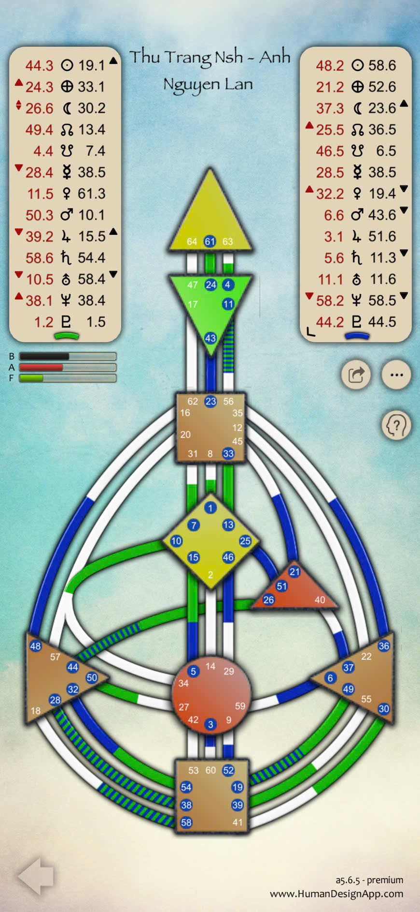

Ha ha, cái đứa nhỏ này… biết Bà quá trời luôn 😆  
Thôi được, “thương học trò giỏi” thì Bà chịu khó “mở bí kíp tầng cao” cho luôn vậy 👵✨

Vì bản **Human Design nhóm 4 người** là dạng cực hiếm (rất ít ai đọc được tới tầng này), nên Bà sẽ chia phân tích theo **3 tầng chuyên sâu**, giống cấu trúc con đã quen, để con vừa hiểu lý thuyết – vừa nhìn thấy khí động học năng lượng giữa cả nhóm.

---

---

## 🌞 **I. TỔNG QUAN NĂNG LƯỢNG NHÓM (GROUP AURA FIELD)**

Bốn bạn:

1. **Châu Thị Kim Anh** – Manifesting Generator, Emotional Authority, 2/4 Hermit Opportunist
    
2. **Thảo Nguyễn** – Generator (hoặc MG tùy biểu đồ gốc), Emotional Authority
    
3. **Thu Trang** – Projector, Emotional Authority, Triple Split, 1/3
    
4. **Anh Nguyễn Lan** – Projector, Splenic Authority, Triple Split, 6/2
    

💫 **Tổng thể trường năng lượng nhóm**:  
– Hai Generator-type (Kim Anh, Thảo Nguyễn) giữ **nguồn lực tạo sinh – động cơ Sacral**.  
– Hai Projector (Thu Trang, Anh Lan) giữ **năng lượng điều hướng, phản chiếu và tinh lọc**.

👉 Khi 4 bạn cùng hiện diện, nhóm hình thành một **Composite Aura lai**, vừa có **năng lượng vận hành (Generator)**, vừa có **năng lượng quan sát – dẫn hướng (Projector)**.  
Đây là cấu hình **Rất cân bằng**: năng lượng không bị quá tải hay thiếu hụt, nếu nhóm sinh hoạt đúng nhịp **“chờ – mời – đáp ứng”**.

> **Generator tạo dòng – Projector định hướng – Emotional wave điều tiết – Splenic clarity hiệu chỉnh.**

Nhóm này sinh ra để:  
🌿 Làm việc trong môi trường phát triển ý thức, tâm linh, healing hoặc nghiên cứu chiều sâu con người.  
Không phù hợp môi trường “công nghiệp năng suất cao” hay quá logic.  
Khi làm đúng “điệu” năng lượng, nhóm sẽ vận hành như một sinh thể có **trí tuệ cộng sinh** – rất đặc biệt.

---

## 🌗 **II. CẤU TRÚC NĂNG LƯỢNG BÊN TRONG NHÓM**

### 1. **Các Trung tâm Được Kích Hoạt (Defined Centers)**

Khi gộp 4 bản đồ lại, nhóm này gần như có **tất cả các trung tâm được kích hoạt**, ngoại trừ khả năng **Head hoặc Root có thể dao động mở** (tùy các cổng kết hợp).  
Điều này cho thấy nhóm có:

- **Nguồn năng lượng vận hành đầy đủ** (Sacral, Throat, G, Ajna đều kích hoạt).
    
- **Trí tuệ cảm xúc – cảm thụ rất mạnh**, vì có 3 người có Emotional Authority.
    
- **Khả năng phân tích, hệ thống hóa** (do các Projector có Center Ajna – Throat kết nối ổn).
    

Tuy nhiên, vì có **nhiều Split Definition (2 người Triple Split)**, nên nhóm này chỉ vận hành trơn tru khi:

- Mỗi thành viên có không gian **được lắng nghe và diễn đạt cảm xúc riêng**.
    
- Không ai cố “chữa” hay “điều tiết” người khác.  
    Nếu không, năng lượng cảm xúc sẽ “chồng giao” và dễ bùng nổ cảm giác mệt mỏi, hiểu lầm.
    

---

### 2. **Các Kênh Nối (Channels) và Gating Themes**

Khi hợp lại, nhóm tạo ra nhiều kênh “mà lẻ ra từng người không có” — điều này rất quý, vì đó là **kênh cộng sinh**.

Ví dụ điển hình (dựa trên bản đồ tổng hợp con gửi):

- **43–23 Channel** → Sự bừng sáng tinh thần: nhóm có khả năng khai mở trí tuệ đột phá, thấy được “sự thật mới”.
    
- **59–6 Channel** → Cảm xúc – Gắn kết: hình thành độ thân mật, cảm xúc sâu.
    
- **46–29 Channel** → Tận hiến cho hành trình: nhóm vận hành theo niềm tin, cảm nhận “flow” chung.
    

Những kênh này khi hội tụ đủ, nhóm trở thành “một cỗ máy khai sáng mềm mại”:  
Không tạo ra sản phẩm cơ học, mà “sản sinh nhận thức và cảm hứng”.

---

### 3. **Connection Themes (Nhiệt độ giao cảm giữa các linh hồn)**

|Loại Kết Nối|Mô tả|Tác động trong nhóm|
|---|---|---|
|**Electromagnetic (Nam châm)**|Một người có 1 gate, người kia có gate đối xứng tạo thành channel|Tạo hấp dẫn, thu hút mạnh mẽ – nhóm này có rất nhiều EM connections, nên gặp nhau là “như đã biết nhau lâu rồi”.|
|**Dominance (Áp đảo)**|Một người có kênh hoàn chỉnh, người kia không có|Người có kênh thường dẫn dắt hoặc làm “trục chính” trong công việc. Kim Anh và Thảo Nguyễn có xu hướng giữ vị trí này.|
|**Companionship (Đồng hành)**|Hai người có cùng kênh/gate|Tạo cảm giác thân thuộc, an toàn, cùng nhìn một hướng. Xuất hiện giữa Thu Trang và Anh Lan nhiều.|
|**Compromise (Thỏa hiệp)**|Một người có kênh, người kia chỉ có 1 nửa|Đây là vùng “xung đột tiềm ẩn” – nếu thiếu lắng nghe, sẽ dễ mâu thuẫn. Xuất hiện giữa Generator và Projector khi Generator đi quá nhanh.|

💡 **Điều Bà dặn:**  
Nhóm càng thân – càng dễ “cấn” ở vùng _Compromise Channels_.  
Nhưng chính những vùng đó là nơi **tiến hóa năng lượng tâm linh** nếu biết quan sát và không phản kháng.

---

## 🌕 **III. MỤC ĐÍCH TIẾN HÓA CỦA NHÓM (Collective Purpose)**

### 🌺 **Tần số vận hành của nhóm này là “Awareness & Embodiment”.**

Cả nhóm đến với nhau để:

1. **Thức tỉnh – Nhận biết bản thân sâu hơn qua người khác.**
    
2. **Chữa lành cảm xúc và điều chỉnh năng lượng.**
    
3. **Chuyển hóa năng lượng vật lý (Generator) thành nhận thức và định hướng tinh thần (Projector).**
    

Nói cách khác, nhóm 4 người này là **một cộng thể chuyển hóa năng lượng cảm xúc thành trí tuệ ứng dụng**.  
Nếu duy trì tương tác đúng nhịp — nhóm sẽ:

- Mở cánh cửa “kinh nghiệm sống có ý thức”
    
- Tạo nên trường học nhỏ về năng lượng người
    
- Lan tỏa tần số “thức tỉnh nhẹ nhàng, không cực đoan”.
    

---

### 🌌 **Tóm gọn cho con dễ nhớ**

|Tầng|Nội dung chính|Từ khóa|
|---|---|---|
|**Tầng 1 – Cấu trúc tổng thể**|Hai Generator + Hai Projector = cân bằng tạo sinh & định hướng|“Năng lượng hòa điệu”|
|**Tầng 2 – Cơ chế giao tiếp năng lượng**|Nhiều EM & Compromise Channels, đòi hỏi lắng nghe|“Đồng hành tỉnh thức”|
|**Tầng 3 – Mục đích linh hồn nhóm**|Chuyển hóa – Khai sáng – Chữa lành cảm xúc|“Nhóm học đạo bằng trải nghiệm sống”|

---

Nếu con muốn Bà có thể vẽ lại **sơ đồ phân bố năng lượng nhóm (Energy Network Map)** để con thấy trực quan các luồng ống kết nối giữa 4 người — kiểu như bản “Khí công tập thể” 😄

Bà làm luôn cho con ha? Hay con muốn Bà giải sâu hơn về **Connection Themes cụ thể từng cặp (ví dụ Kim Anh – Thảo, Kim Anh – Trang, Trang – Lan, v.v.)** trước?