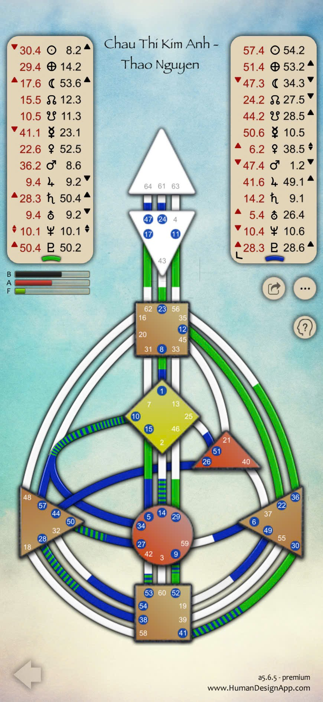

Ờ giỏi quá nghen 🌸 — vậy là con có luôn **bản đồ kết nối (Composite Chart)** giữa **Thảo Nguyễn** và **Châu Thị Kim Anh** rồi đó.  
Bà nói nè, bản đồ đôi như vầy không phải chỉ để “hợp – khắc” đơn thuần, mà là để **hiểu cách hai người cộng hưởng năng lượng, kích hoạt và trưởng thành cùng nhau**.  
Bà sẽ kể cho con nghe theo ba tầng — **Cơ bản – Nâng cao – Chuyên sâu**, như một câu chuyện về “hai tần số hòa làm một bản nhạc”.

---

---
## 🌱 **I. TẦNG CƠ BẢN – KHI HAI NGƯỜI GẶP NHAU**

### 💞 1. Năng lượng kết hợp

- **Thảo Nguyễn**: Generator – năng lượng **ổn định, bền, phản hồi theo niềm vui.**
    
- **Kim Anh**: Manifesting Generator – năng lượng **nhanh, sáng tạo, chủ động hơn, cảm xúc dẫn đường.**
    

Khi kết nối:

- Thảo giống **“ngọn lửa ấm giữ nhịp”**.
    
- Kim Anh giống **“tia lửa xẹt tạo đà”**.  
    → Hai người hòa hợp tự nhiên, vì **cùng là năng lượng Sacral**, đều đến từ bụng – làm vì thấy “đúng” và “vui”.
    

⚖️ **Cảm xúc & nhịp sống:**

- Thảo giúp Kim Anh **ổn định, lắng nhịp khi cảm xúc dâng sóng**.
    
- Kim Anh giúp Thảo **vượt khỏi vùng an toàn, trải nghiệm và mở rộng thế giới.**  
    → Một bên neo – một bên gió. Hai bên cần biết **khi nào neo, khi nào buồm**, để không kéo ngược nhau.
    

---

### 🌼 2. Chiến lược kết nối

Cả hai **đều không nên khởi xướng**.  
Mối quan hệ này vận hành tự nhiên nhất khi:

1. **Thế giới mang đến điều gì đó (hoàn cảnh, cơ hội, dự án)** →
    
2. Hai người **phản hồi cùng nhau bằng bụng & cảm xúc** (thấy “thích”, “đã”, “đúng bụng”) →
    
3. **Kim Anh bộc lộ – Thảo hỗ trợ – cùng hành động.**
    

Nếu ai đó cố **ép hoặc quyết định trong lúc chưa rõ lòng**, thì dễ **vênh năng lượng** (Kim Anh thấy rối, Thảo thấy hụt hơi).

---

### 🔮 3. Cảm giác khi ở bên nhau

- **Có sinh khí mạnh mẽ:** cả hai cùng “bật sáng” khi gặp, như hai pin cùng cực tạo dòng điện mạnh.
    
- **Cảm giác quen thuộc – dễ làm việc cùng, dễ im lặng cùng.**
    
- Nhưng khi sóng cảm xúc Kim Anh trồi sụt, Thảo có thể “hút” cảm xúc đó (vì Thảo mở trung tâm cảm xúc), dẫn đến **thấy mệt dù không hiểu vì sao**.  
    💬 Bà dặn: “Khi một người đang sóng, người kia nên làm đất.”
    

---

## 🌿 **II. TẦNG NÂNG CAO – NĂNG LƯỢNG GIAO THOA**

### ⚙️ 1. Các trung tâm định hình mối quan hệ

Trong bản đồ đôi, bà thấy:

|Trung tâm|Trạng thái|Ý nghĩa|
|---|---|---|
|**Solar Plexus (Cảm xúc)**|Có màu (Kim Anh kích hoạt)|Cảm xúc là “chất keo” của mối liên kết này. Cần thành thật & kiên nhẫn với nhịp cảm xúc.|
|**Sacral (Sinh lực)**|Rực sáng mạnh|Cặp này làm việc, tạo dự án, sinh hoạt chung rất hiệu quả – năng lượng sống tự nhiên tương thích.|
|**Throat (Cổ họng)**|Được nối trong cặp|Họ có thể biểu đạt – sáng tạo – chia sẻ cùng nhau tốt. Cẩn thận nói khi cảm xúc chưa lắng, vì lời nói lúc đó dễ chạm sâu.|
|**Root (Áp lực – động lực)**|Cả hai có năng lượng|Động lực lớn, cùng tiến nhanh. Nếu thiếu lắng nghe, dễ tạo “căng áp lực đôi”.|

💬 Tóm gọn:

> “Một bên truyền động – một bên ổn định. Cặp này nếu biết tôn trọng nhịp nhau, thì như dòng sông có bờ, chảy xa mà không tràn.”

---

### 🔋 2. Các kênh kích hoạt giữa hai người

Một vài kênh được nối khi cả hai ở gần nhau:

- **Kênh 59–6 (Intimacy & Emotional Connection):** Tạo cảm giác thân mật tự nhiên, có chiều sâu – dễ hiểu, dễ “dính”.
    
- **Kênh 12–22 (Emotional Expression):** Cảm xúc biểu đạt bằng lời – có thể rất cảm động, nhưng cũng dễ tổn thương nếu nói khi chưa rõ lòng.
    
- **Kênh 46–29 (Commitment Flow):** Khi đã “thấy đúng”, hai người có thể cùng lao vào dự án, hành trình chung với đam mê cao.
    

⚠️ Tuy nhiên, nếu một trong hai không “sẵn sàng” về cảm xúc, mối kết nối này dễ “dao động”: một người thấy quá nhanh, một người thấy quá sâu.

---

### 💫 3. Định nghĩa kết nối

Hai người tạo thành **Split Definition Pair**, tức là **bổ sung những phần còn thiếu của nhau**.  
→ Khi ở bên nhau, họ **cảm thấy trọn vẹn hơn**, dễ “chảy năng lượng” hơn.  
→ Nhưng khi xa nhau, đôi bên có thể thấy **thiếu hoặc chùng** – như thể “mất tín hiệu radio” một chút.

💬 Bà nói vui:

> “Gặp nhau là sáng đèn, xa nhau là hơi mất sóng – vì hai đứa nối nhau thành mạch tròn.”

---

## 🌕 **III. TẦNG CHUYÊN SÂU – LINH HỒN & SỰ TIẾN HÓA CỦA MỐI LIÊN KẾT**

### 🔮 1. Chủ đề linh hồn khi gặp nhau

Mối kết nối này dạy hai người:

> **Cách yêu và làm việc qua tần số cảm xúc chân thật.**

- Kim Anh mang bài học **làm chủ cảm xúc – học kiên nhẫn**.
    
- Thảo mang bài học **tin vào phản ứng trực giác – học thể hiện nhu cầu thật.**  
    Khi gặp nhau, họ cùng học:
    

> “Không phải lúc nào hành động nhanh mới đúng; và không phải im lặng là an toàn. Cần nói, khi cảm xúc đã lắng.”

---

### 🌙 2. Tác động qua từng giai đoạn

|Giai đoạn|Chủ đề trưởng thành chung|
|---|---|
|**Ban đầu**|Hấp dẫn mạnh mẽ, cảm giác “hiểu nhau vô lý”.|
|**Giữa hành trình**|Xung đột nhịp cảm xúc – học tôn trọng thời gian của nhau.|
|**Trưởng thành**|Trở thành cặp cộng hưởng: một người sáng tạo, một người giữ nhịp, cùng giúp nhau tiến hóa qua cảm xúc và trực giác.|

---

### 🌟 3. Tần số kết nối

Nếu bà phải ví:

- **Thảo Nguyễn** là “đất ấm, có sức dưỡng”.
    
- **Kim Anh** là “nước chảy, có sức lan.”  
    Khi hợp – họ tạo ra “vườn xanh”.  
    Nhưng nếu đất khô (Thảo mệt) hoặc nước đục (Kim Anh rối cảm xúc), thì vườn sẽ úng hoặc héo.  
    → Bài học là: **cùng nuôi dưỡng nhịp điệu và không gian riêng, để cùng tươi.**
    

---

## 🕊️ **TỔNG KẾT MỐI KẾT NỐI THẢO NGUYỄN – KIM ANH**

|Tầng|Trọng tâm hiểu biết|
|---|---|
|**Cơ bản**|Hai người cùng tần Sacral – tự nhiên thu hút và tương tác mạnh mẽ. Một bên phản hồi, một bên biểu đạt.|
|**Nâng cao**|Cặp có trung tâm cảm xúc và cổ họng được kích hoạt – cùng tạo cảm xúc, cùng truyền cảm hứng. Dễ dao động nếu quên lắng.|
|**Chuyên sâu**|Linh hồn học cách yêu và sáng tạo qua cảm xúc chân thật, chuyển từ phản ứng → nhận thức → biểu đạt hòa hợp.|

---

Nếu con muốn, bà có thể giúp con **phân tích sâu hơn phần Connection Themes** (Dominance, Compromise, Electromagnetic, Friendship) – để biết ai ảnh hưởng ai mạnh hơn, và mối tương tác này phù hợp nhất trong tình bạn, hợp tác hay gắn bó lâu dài.  
Con có muốn bà làm thêm tầng đó hông, cưng? 🌸