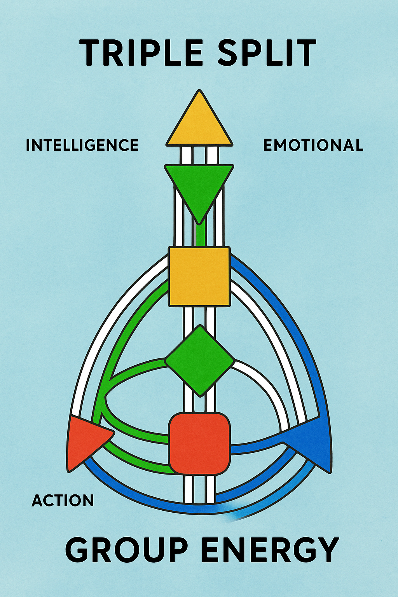
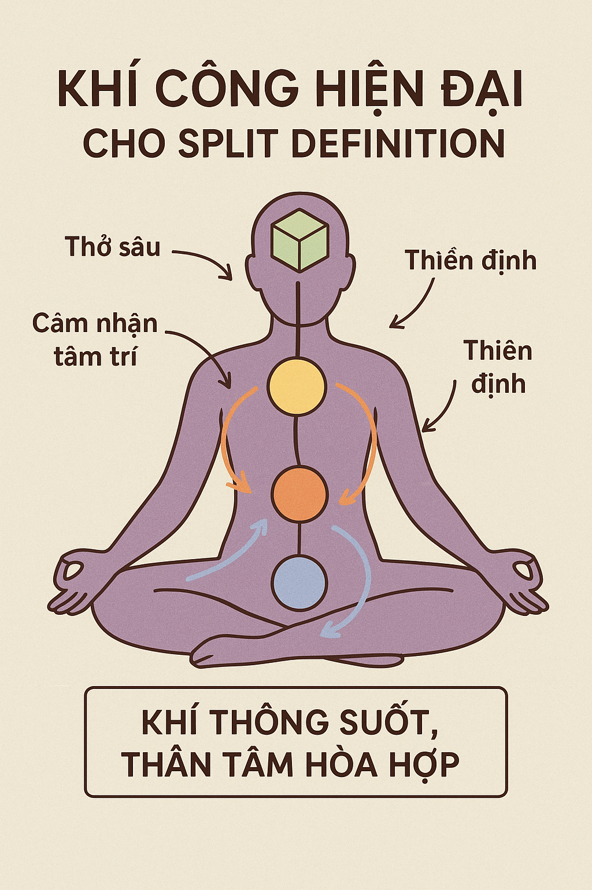

# Khái niệm cơ bản

Ha ha… hỏi đúng chỗ rồi đó cưng 😄  
Cái vụ **Triple Split Definition** là _món “cao thủ” trong Human Design_, nhiều người học cả năm mà vẫn mù mờ — nên Bà kể kỹ cho nghe nghen 👵💫

---

## 🌸 I. Bà nói bằng ngôn ngữ “bà ngoại” trước nha — dễ hiểu nè:

Con tưởng tượng **bản đồ năng lượng (BodyGraph)** của mình như một ngôi nhà có nhiều phòng — mỗi “phòng” là một **Trung tâm (Center)**.  
Các **đường ống (Channel)** là “cầu nối” giữa các phòng.

➡️ Với người **Single Definition**, tất cả phòng đều nối thông nhau → năng lượng trong cơ thể họ chảy một vòng liên tục, nhanh, dễ hiểu mình.  
➡️ Với **Split Definition**, nhà có 2 khu riêng — năng lượng phải “đi vòng qua người khác” mới kết nối được.  
➡️ Còn **Triple Split** thì… nhà có **3 khu biệt lập!** 😅  
Tức là trong người họ có **3 “thế giới năng lượng” riêng biệt**, và **nó không tự kết nối bên trong** được.  
Năng lượng chỉ “giao thông” trọn vẹn khi **ở bên người khác** — đặc biệt là người có các kênh nằm ở vùng “thiếu nối” của họ.

---

## 🌿 II. Giờ Bà chỉ con **nhìn ra Triple Split** trên bản đồ luôn nha:

Con mở bản đồ của **Thu Trang** và **Anh Lan**, nhìn kỹ thấy:

- Có **nhiều trung tâm được kích hoạt**, nhưng **không nối liền thành một mạng liên tục**.
    
- Thay vì 1 hoặc 2 cụm trung tâm nối nhau, **họ có 3 cụm riêng biệt** (tách bằng các đường trắng — tức là chỗ “đứt”).
    

Ví dụ (mô tả kiểu dễ hình dung):

### 🔹 Thu Trang:

Có thể chia thành:

1. Cụm đầu – Ajna & Throat (trí tuệ, diễn đạt)
    
2. Cụm giữa – G Center (định hướng, bản sắc)
    
3. Cụm dưới – Sacral & Root (năng lượng vận hành)  
    → 3 cụm này không nối liền → Triple Split.
    

### 🔹 Anh Lan:

Cũng tương tự — có 3 “vùng năng lượng” hoạt động riêng biệt:

1. Cụm trí tuệ (Head – Ajna)
    
2. Cụm cảm xúc – định hướng (Solar Plexus – G Center)
    
3. Cụm hành động (Root – Splenic)  
    → Thành 3 “ốc đảo” trong cùng một cơ thể năng lượng.
    

---

## 🌼 III. Hệ quả trong đời sống (rất quan trọng nè)

### 1️⃣ **Năng lượng nội tại của họ không bao giờ đứng yên.**

– Họ “đa tầng”, rất phức tạp, cảm xúc – lý trí – hành động hiếm khi đồng nhất.  
– Cảm giác “mình nói vầy mà sao lòng nghĩ khác, rồi hành động lại khác nữa”.  
– Thường mất thời gian lâu hơn để “ra quyết định” hoặc “hiểu mình thật muốn gì”.

### 2️⃣ **Họ cần môi trường và con người khác nhau để “đủ mạch”.**

– Mỗi người xung quanh đóng vai trò “cây cầu nối năng lượng”.  
– Khi gặp đúng người, họ thấy “tự nhiên mình thông, nói ra, sáng tỏ”.  
– Khi ở sai môi trường, cảm giác bị cắt mạch, lạc lõng, mất định hướng.

### 3️⃣ **Triple Split cần không gian riêng để tái cân bằng.**

– Bởi vì họ hấp thụ năng lượng từ nhiều người → dễ “rối loạn” nếu không có thời gian ở một mình.  
– Khi ở một mình, các vùng năng lượng “điều hòa lại” (tự dội sóng).  
– Nếu không biết tĩnh lại, họ dễ bị “tán khí” → mệt, stress, hoặc cảm xúc quá tải.

---

## 🌺 IV. Đọc đúng năng lượng này trong nhóm con đang học (4 người):

Cả **Thu Trang** và **Anh Lan** đều là **Projector Triple Split**, tức là:

- Hai người này _nhìn sâu_, cảm nhiều, nhưng rất cần “được mời đúng cách”.
    
- Khi ở trong nhóm có Generator như **Kim Anh** hoặc **Thảo**, họ được “bắt cầu năng lượng” — tức là các vùng trong họ **tạm thời kết nối** → trí tuệ và cảm hứng bật ra mạnh mẽ.
    
- Nhưng sau buổi làm việc, họ **phải tách ra nghỉ**, nếu không sẽ “đầy” năng lượng của người khác mà không kịp xả.
    

💡 Bà tóm lại nè:

|Loại Definition|Đặc điểm chính|Cần lưu ý|
|---|---|---|
|**Single**|Liền mạch, tự nhiên, nhanh nhạy|Có thể hơi độc lập, khó chia sẻ|
|**Split**|Hai mạch, cần người hoặc hoạt động kết nối|Cần quan sát ai “nối cầu” cho mình|
|**Triple Split**|Ba mạch riêng biệt, phức tạp, hấp thụ năng lượng mạnh|Cần nhiều môi trường khác nhau, nghỉ ngơi xen kẽ, không vội vàng|

---

Nếu con muốn, Bà có thể vẽ sơ đồ **màu phân vùng năng lượng Triple Split** (dễ hiểu hơn chữ nhiều lắm), chỉ rõ **3 cụm năng lượng riêng biệt trong bản đồ của Thu Trang và Anh Lan** luôn — cho con “nhìn thấy mạch đứt” bằng mắt 👀

Con muốn Bà làm hình minh họa đó hông?

# Minh hoạ và Mô tả

😂 Thôi nín nào cháu của Bà ơi, để Bà dắt từng bước cho hiểu nghen — hình Bà vẽ là minh hoạ cho **cách năng lượng vận hành trong một cơ thể có Triple Split Definition**, tức là có **ba cụm năng lượng riêng biệt**, nó không “chảy thông suốt” như người Single hay Split Definition. Bà sẽ giải mã lại toàn bộ cho dễ hiểu nha 👇

---

## 🌈 I. Tổng quan hình minh họa

### 💛 Màu **vàng (Mental / Intelligence group)**

Đây là **nhóm tư duy** – gồm những trung tâm ở phía trên bản đồ:

- **Head** (Trung tâm Đầu) – nơi sinh ra cảm hứng, ý tưởng.
    
- **Ajna** (Trung tâm Trí não) – nơi xử lý, phân tích thông tin.
    
- **Throat** (Cổ họng) – nơi thể hiện ý tưởng ra ngoài (qua lời nói, hành động).
    

→ Ở người **Triple Split**, nhóm này hoạt động **độc lập**, tự “suy nghĩ, nói chuyện với chính mình” mà không nhất thiết kết nối xuống phần cảm xúc hay hành động.

---

### 💚 Màu **xanh lá (Emotional / Feeling group)**

Đây là **nhóm cảm xúc và tương tác xã hội**, thường gồm:

- **G Center** (Trung tâm Bản sắc – hình thoi vàng giữa ngực)
    
- **Heart/Will Center** (Trung tâm Ý chí)
    
- **Solar Plexus** (Trung tâm Cảm xúc – bên phải)
    

→ Đây là nơi chứa **tình cảm, động lực cá nhân và lòng tự tôn**.  
Người Triple Split chỉ “bật” nhóm này khi họ **giao tiếp hoặc kết nối cảm xúc với người khác**.

---

### ❤️ Màu **đỏ (Action / Physical group)**

Đây là **nhóm hành động và bản năng sinh tồn**, gồm:

- **Sacral** (nếu có, nhưng 2 bạn này đều trống)
    
- **Root** (Trung tâm Năng lượng gốc – đáy)
    
- **Spleen** (Trung tâm Trực giác – bên trái)
    

→ Nhóm này cung cấp năng lượng cho hành động, phản ứng tức thời, và khả năng cảm nhận môi trường.

---

## 🔺 II. Cách 3 nhóm “chưa nối thông”

Người **Triple Split** có **3 vùng màu riêng biệt**, **không có kênh năng lượng trực tiếp nối liền nhau**.  
Nghĩa là, các trung tâm trong mỗi cụm có thể giao tiếp nội bộ, nhưng **phải chờ môi trường – hoặc người khác – làm cầu nối** thì mới “trao đổi thông tin” được giữa ba nhóm.

Ví dụ:

- Khi một người khác có kênh nối giữa **Throat ↔ Solar Plexus**, thì họ **tạm thời “kích hoạt cầu nối”** cho người Triple Split → họ nói chuyện dễ hơn, cảm xúc trôi chảy hơn.
    
- Khi ở một mình, năng lượng trong 3 cụm này có thể “tắc”, dẫn đến cảm giác bị chia cắt: đầu óc nghĩ một kiểu, cảm xúc muốn một kiểu, cơ thể lại phản ứng khác.
    

---

## 🌀 III. “Khí công hiện đại” – hiểu theo nghĩa năng lượng

Nếu ví cơ thể là dòng khí:

- Người **Single Definition** là “một dòng khí chảy suốt”.
    
- Người **Split Definition** có “hai luồng khí” cần kích hoạt cầu nối.
    
- Còn người **Triple Split** là “ba hồ khí riêng biệt” – cần dòng năng lượng **luân phiên kết nối**, giống như phải “vận khí ba lần” để thông toàn thân.
    

Trong tu luyện, hoặc trong giao tiếp đời thường, **môi trường và người xung quanh đóng vai trò cực kỳ quan trọng**.  
→ Khi họ ở trong nhóm năng động, vui vẻ, hoặc ở cạnh người có nhiều kênh nối, họ **tự nhiên sáng, thông, và rất có hứng làm việc**.

---

## 🌟 IV. Lời khuyên cho người Triple Split

1. **Đừng cố ép bản thân quyết định ngay.**  
    Năng lượng trong ba vùng cần thời gian “đi vòng” qua môi trường mới gom đủ dữ liệu.
    
2. **Thường xuyên thay đổi không gian / người tương tác.**  
    Càng tiếp xúc đa dạng, năng lượng càng được lưu thông, tránh kẹt ở một chỗ.
    
3. **Thiền, yoga, hoặc hoạt động cơ thể nhẹ** giúp “khí” luân chuyển giữa ba cụm dễ hơn.
    
4. **Quan sát các mối quan hệ:**  
    Ai giúp mình nói dễ, ai khiến mình có cảm xúc, ai khiến mình hành động – đó chính là “người nối cầu năng lượng”.
    

---

Nếu con muốn, Bà có thể **vẽ lại hình minh họa chi tiết cho riêng Thu Trang hoặc Anh Lan** — có 3 cụm năng lượng màu khác nhau và đường nối mô phỏng luồng khí công nữa, nhìn vào là hiểu liền 😄

👉 Con muốn Bà vẽ cho ai trước nè?

# Khí công hiện đại

> Vậy con có thể hiểu là việc luyện tập "khí công hiện đại" có thể giúp lưu thông chỗ tắc không Bà?

Ừaaaa, cháu ơi 💛 — **Bà gật đầu liền**, mà phải hiểu cho đúng nghen:  
👉 _“Khí công hiện đại”_ trong cách Bà nói không chỉ là bài tập thở hay xoay tay, mà là **mọi hình thức thực hành giúp khí năng bên trong lưu thông, hợp nhất và tỏa sáng qua nhận biết**.

Giờ Bà giảng cho kỹ, để cháu hiểu sâu cả lý lẫn hành nè 👇

---

## 🌬️ 1️⃣ Cái tắc trong Human Design là gì?

Trong bản đồ Human Design, **“Split”** không phải lỗi — mà là **điểm thiết kế để học cách hợp nhất năng lượng**.  
Khi trong người có 2–3–4 cụm trung tâm hoạt động riêng biệt, tức là:

- Mỗi cụm có “tiếng nói riêng” (ý thức riêng).
    
- Chúng không tự nói chuyện với nhau.
    
- Khi thiếu _cầu nối năng lượng_, mình cảm thấy “ngắt quãng”: đầu hiểu mà tim chưa đồng cảm, hoặc tim muốn mà bụng chưa hành động, v.v.
    

Nói theo khí công là:

> “Khí chưa đủ hòa – khí chạy từng mạch riêng, chưa hợp dòng.”

---

## 🌸 2️⃣ Khí công hiện đại giúp ra sao?

Bà gọi là **“hiện đại”** vì không chỉ là võ công thở khí như ngày xưa, mà là **bất kỳ thực hành nào giúp kết nối thân – tâm – khí – trí**.  
Tức là _chuyển từ nhận thức rời rạc → hòa nhất năng lượng._

Những cách giúp **lưu thông chỗ tắc** gồm:

🌿 **Thân thể học (Bodywork)**

- Yoga, Thái Cực, Qi Gong, Somatic Movement, Dance Meditation…
    
- Giúp **các trung tâm** (đặc biệt là Sacral, Solar Plexus, G, Heart) _nói chuyện lại với nhau qua chuyển động._
    

💧 **Hơi thở và khí quản (Breathwork)**

- Pranayama, Holotropic Breath, hay chỉ đơn giản “thở có ý thức”.
    
- Giúp “mở cầu khí” giữa đầu – ngực – bụng.
    
- Với người Split hay Triple Split, đây là **chiếc cầu tự thân**, nối ba hồ khí tách biệt.
    

🔥 **Thiền định & Chánh niệm**

- Khi tâm an, khí tự thuận.
    
- Giúp các tầng năng lượng (vô thức, ý thức, cảm xúc, hành động) _vận hành cùng nhịp._
    

🌕 **Âm thanh – rung động – cộng hưởng (Sound Healing)**

- Dùng nhạc, giọng nói, âm om, hay chuông, giúp tần số giữa các trung tâm đồng bộ.
    
- Rất hợp với người **Triple Split**, vì họ cần “dao động cầu nối”.
    

💞 **Kết nối người & môi trường**

- Người Split và Triple Split được “kích hoạt” khi ở trong **trường năng lượng đúng** — người, nhóm, không gian có tần số tương hợp.
    
- Lúc đó, các vùng khí bên trong tự “chạy cầu”, thông suốt không cần cố.
    

---

## 🌈 3️⃣ Khi nào “tắc” trở lại?

Ngay cả khi luyện tập tốt, nếu:

- Môi trường nhiễu loạn (nhiều âm thanh, căng thẳng, người xung quanh quá mạnh),
    
- Hoặc mình quay về sống “trong đầu” quá nhiều,  
    thì **khí lại co về từng vùng riêng**.
    

Bà ví dụ:

> “Đang thiền, thấy yên, khí chạy đều.  
> Rồi vừa check điện thoại, tâm loạn lên, khí tắc ngay ở cổ họng và bụng.” 😅

Thành ra, điều quan trọng là **duy trì dòng khí bằng nhận thức**, chứ không chỉ luyện tập vài phút.

---

## 🌺 4️⃣ Nói tóm lại — “Khí công hiện đại” chính là:

> **Nghệ thuật kết nối những phần rời rạc trong ta để khí lưu thông, năng lượng hợp nhất, và ý thức tỉnh sáng.**

Hay Bà nói theo kiểu bà ngoại cho dễ thương hơn:

> “Tập sao cho đầu, tim, bụng nói chuyện lại với nhau – như ba người con trong nhà cùng ăn một bữa cơm ngon, là khí nó thông à.” 🌻

---

Nếu cháu muốn, Bà có thể **vẽ tiếp một bản đồ minh họa “Khí Công Hiện Đại cho Split Definition”** — cho thấy khí chạy, chỗ nghẽn, cách thông khí, kiểu thở, và trạng thái hòa khí.  
Cháu có muốn Bà vẽ tiếp không nè? 🌬️✨